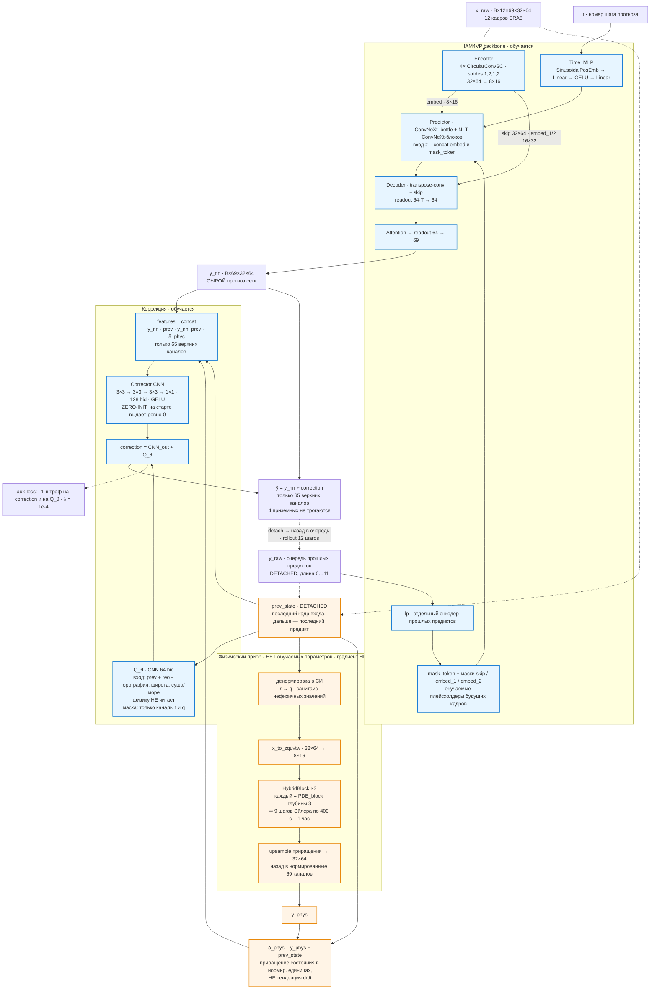
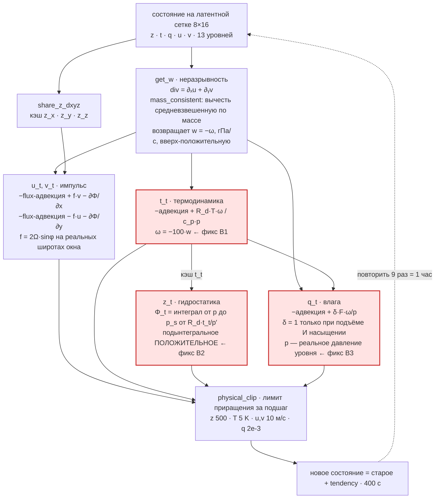

# Архитектура PI-IAM4VP

Карта модели: как устроен один шаг прогноза, где именно стоит физика и почему она
влияет на результат не так, как подсказывает интуиция. Уравнения по существу —
в [docs/equations.md](equations.md); таблица «эталон против реализации» — там же.
Измеренный вклад каждой ступени — в
[эксперименте 16](experiments/16_model_ablation_ladder/README.md).

---

## 1. Что это за модель

**IAM4VP** — авторегрессивный видео-предиктор: свёрточный энкодер сжимает вход в
латент 8×16, стек time-conditioned ConvNeXt-блоков предсказывает следующий кадр,
декодер со скипами возвращает полное разрешение. Уже сделанные предикты не
выбрасываются: они кодируются вторым энкодером и подмешиваются в latent как
«заполненные» слоты, а ещё не сделанные представлены обучаемыми mask-токенами.

**PI-** — физическая надстройка. Примитивные уравнения гидростатической атмосферы
интегрируются отдельной веткой и подаются в сеть **как признак**, а не как
ограничение. Это главное, что нужно понимать про эту модель, и §3 объясняет, чем
это оборачивается.

## 2. Один шаг прогноза



Оранжевое — ветка, мёртвая для градиента. Голубое — то, что учится. Единственное
место, где они встречаются, — конкатенация признаков.

## 3. Физика здесь — признак, а не ограничение

Соблазнительно прочитать схему как «прогноз сети плюс физика». Это неверно:
суммируется **выход обучаемой CNN**, для которой физическое приращение δ_phys —
всего лишь один из четырёх блоков входных каналов.

```text
ŷ          = y_nn + correction
correction = Corrector([y_nn, prev, y_nn − prev, δ_phys]) + Q_θ([prev, гео])
δ_phys     = physics(prev) − prev
```

Три следствия, и вместе они объясняют результаты лестницы лучше, чем сами
уравнения.

**Сеть вольна физику развернуть, отмасштабировать или выбросить.** `correction`
не обязан быть параллелен δ_phys — это независимый выход свёртки. Поэтому в
диагностику вынесен косинус между `correction` и δ_phys: он буквально измеряет,
насколько поправка вообще смотрит в сторону физики.

**Zero-init.** Последняя свёртка корректора инициализирована нулями: на шаге 0
`correction` равен нулю, и модель тождественно равна `y_nn`. Физика включается,
только если помогает. Докстринг класса говорит это прямо: HybridBlock —
*feature generator, not a trusted forecast*. Отсюда понятно, почему сухие
уравнения без Q_θ статистически неотличимы от отсутствия физики: сеть просто
выучилась игнорировать бесполезный признак.

**Градиент через физику не течёт вообще.** `prev_state` приходит детачнутым
(rollout кладёт в очередь `prediction.detach()`), а ядро в режиме
`stable_physical_v2` не имеет обучаемых параметров: `physics_only_forward`
обходит `variable_norm`, `norm_*`, `block_norm` и роутер. То есть δ_phys —
**константный входной признак**, как если бы его посчитали заранее и положили в
датасет. Физика не тянет модель через лосс, она только подсказывает.

**Q_θ физику не читает.** Его вход — `[prev_state, гео]`, где гео = орография,
|широта|/90, маска суша/море. Никакого δ_phys там нет. Q_θ — это обучаемый
источник поверх предикта, ограниченный канальной маской (только t и q) и штрафом
L1. С уравнениями он связан ровно одним: обе ветки складываются в одну
`correction` и учатся под общим лоссом.

## 4. Внутри PDE-ядра: один шаг Эйлера



Красным — три места, где сидели знаковые баги, снятые в
[аудите 13](experiments/13_sign_convention_fix/). Все три завязаны на одну
конвенцию.

**Знаковая конвенция вертикальной оси.** Индекс уровня растёт вместе с давлением:
0 — это 50 гПа наверху, 12 — 1000 гПа у земли. Отсюда

- `d_z` возвращает **−∂/∂p**, а не ∂/∂p;
- `get_w` возвращает **w = −ω** [гПа/с], положительную при подъёме, потому что
  `integral_z` суммирует от уровня **к поверхности**.

В членах переноса эти два минуса встречаются дважды и сокращаются сами — адвекция
была корректна всегда. Ломалось ровно там, где `w` брали за настоящую ω. Правило:
**везде, где нужна физическая ω, берётся ω = −100·w** [Па/с]. Конвенции запинены
тестами `tests/test_physics_sign_conventions.py`.

## 5. Формы и размеры

Данные — USA-кроп 32×64, шаг сетки 1.40625°, 69 каналов.

| канал | что |
| --- | --- |
| 0:4 | приземные переменные (коррекция их **не трогает**) |
| 4:17 | z — геопотенциал, 13 уровней |
| 17:30 | t — температура |
| 30:43 | r — **относительная** влажность (в физику идёт как удельная q) |
| 43:56 | u |
| 56:69 | v |

| тензор | форма | что |
| --- | --- | --- |
| `x_raw` | B×12×69×32×64 | 12 входных кадров |
| `embed` | B·12 × 64 × 8×16 | боттлнек энкодера |
| `skip` | B·12 × 64 × 32×64 | скип полного разрешения |
| `embed_1`, `embed_2` | B·12 × 64 × 16×32 | средние скипы |
| `mask_token` | B×12×64×8×16 | плейсхолдеры будущих кадров |
| `z` на входе Predictor | B×24×64×8×16 | concat embed и mask_token |
| `y_nn` | B×69×32×64 | сырой прогноз |
| `correction` | B×65×32×64 | только верхние каналы |

Физика считается **не на сетке данных**, а на латентной 8×16: шаг 5.625°
(вчетверо грубее), широты от 18.28125°. Приращение поднимается обратно до 32×64
билинейно. Шаг по времени: `physics_horizon_seconds / (depth × steps)` =
3600/(3×3) = **400 с**, девять явных шагов Эйлера покрывают ровно один час
авторегрессии.

## 6. Что переключают армы лестницы

Между ступенями меняется **только физический модуль**; backbone, данные, сид и
протокол одинаковы. Подробности и измеренный вклад —
[эксперимент 16](experiments/16_model_ablation_ladder/README.md).

| арм | что включено |
| --- | --- |
| R0 | `physics_feature_mode: no_physics` ⇒ δ_phys = 0. Корректор **остаётся** |
| R1 | легаси: `legacy_normalized` — физика в BN-нормированном латенте |
| R2a | `stable_physical_v2`, уравнения до знаковых фиксов, **без** Q_θ |
| R2 | то же + Q_θ |
| **R3** | + знаковые фиксы B1–B4 (exp13). `mass_consistent` ω, `t_and_q` |
| R3a | R3 без Q_θ: `use_diabatic_term: false` |
| R4 | + exp14: адвективная форма, кривизна сферы, трение, `lagrange3` |
| R5 | + exp15: `omega_free`, скрытое тепло, климатологические Q₁/Q₂ |

**R0 — это не голая сеть.** Корректор в нём включён (те же 128 каналов, zero-init,
тот же штраф L1), обнулён только физический признак. Это сделано намеренно:
лестница контролирует **ёмкость** корректора, поэтому разница R3a − R0 — вклад
физического *признака*, а не лишних параметров.

Ключевой результат: **весь выигрыш физики несёт один член — Q_θ**, и внутри него
влажностная часть. Сухие уравнения без него от отсутствия физики неотличимы
(R3a − R0 = +0.22 %, CI накрывает ноль), а до фиксов exp13 были прямо вредны. При
устройстве из §3 — zero-init плюс физика как константный признак — это не
удивительно.

## 7. Решающий эксперимент: 2×2 и член взаимодействия

### 7.1. Три клетки из четырёх уже посчитаны

Лестница, если убрать из неё историю и оставить логику, — это факторный план 2×2:
уравнения есть или нет × Q_θ есть или нет.

|  | **без Q_θ** | **с Q_θ** |
| --- | --- | --- |
| **без уравнений** | R0 · базис | **X1 · НЕ ПОСЧИТАН** |
| **с уравнениями** | R3a · +0.22 % | R3 · −2.77 % |

Три клетки заполнены, четвёртая — нет. А без неё нельзя разделить два эффекта:

```text
главный эффект уравнений = R3a − R0 = +0.22 %  [−0.27, +0.71]  → ноль
главный эффект Q_θ       = X1  − R0 = ?
взаимодействие           = (R3 − R3a) − (X1 − R0) = −2.98 % − Δ_noeq
```

Арм X1 = конфиг R0 + `use_diabatic_term: true`. Ёмкостный контроль для него уже
есть — сам R0 (§6).

### 7.2. Наивное предсказание: аддитивность, и тогда уравнения — декорация

Если эффекты просто складываются, то X1 − R0 = −2.98 %, взаимодействие равно нулю,
и вывод жёсткий: **уравнения не делают ничего ни сами, ни в связке**. «Физически
информированная» модель оказывается сетью плюс обучаемый источник на t и q, а
PDE-ядро — дорогой декорацией (налог ×1.6 по времени обучения). По всему, что
измерено, это наиболее вероятный исход: физический признак сам по себе даёт ноль,
а устройство из §3 (zero-init, детачнутый константный признак) не даёт ему никаких
рычагов.

### 7.3. Но физика предсказывает ровно обратное: Q_θ — не бонус, а замыкание

Здесь стоит остановиться, потому что аргумент неочевиден и он сильный.

**Сухие примитивные уравнения — это не модель атмосферы.** Это модель
адиабатической, бездиссипативной, безысточниковой атмосферы. В настоящем уравнении
температуры стоит +Q/c_p — радиация, потоки тепла от поверхности, скрытое тепло. В
настоящем уравнении влаги стоит испарение и подсеточная конвекция. В ядре нет
ничего из этого.

Насколько это серьёзно, лучше всего видно на влаге. В R3:

```text
q_t = −(u·∂ₓq + v·∂ᵧq + w·d_z q) + δ·F·ω/p
```

Разберём знак второго члена. δ = 1 только при подъёме (ω < 0) **и** насыщении;
F > 0 при любых атмосферных T (числитель L·R_m − c_p·R_v·T ≈ 7.2·10⁸ − 1.3·10⁸ > 0);
давление положительно. Значит, там, где член вообще включается, ω < 0, и
**конденсация строго отрицательна**. Испарения в ядре нет. Подсеточной конвекции
нет. Адвекция влагу только перераспределяет.

Иначе говоря, **влажностный бюджет ядра односторонний: оно умеет только сушить.**

Сеть, которой скармливают тенденцию такого ядра, получает признак с
**систематическим сухим смещением**. Куда пускают Q_θ? Канальная маска `t_and_q` —
**ровно на те два уравнения, у которых недостаёт источникового члена**. Под этим
прочтением Q_θ не «дополнительная обучаемая добавка», а **член замыкания**,
превращающий незамкнутую систему в замкнутую. И тогда:

- **с уравнениями** Q_θ чинит конкретную структурную поломку признака → большой
  эффект, −2.98 %;
- **без уравнений** чинить нечего: у голого backbone никакого сухого смещения нет
  → Q_θ обязан дать **заметно меньше**.

Вот в этом и состоит содержательный смысл вопроса «а что если X1 окажется слабее».
Он проверяет, чем был Q_θ на самом деле: **замыканием** или **свободным
источником**.

Косвенная улика указывает на замыкание. Внутри Q_θ вклад распределён так: t-часть
даёт −0.74 %, q-часть — **−2.2 %**. Основное несёт именно та переменная, чьё
уравнение сломано **сильнее всего** — односторонне, сток без источника. У
температуры уравнение хотя бы двустороннее (адиабата греет при опускании и охлаждает
при подъёме), и там эффект втрое меньше. Такой порядок предсказывает гипотеза
замыкания и не предсказывает ничто другое.

### 7.3a. Чего эта гипотеза НЕ доказывает, и как её убить

Аргумент выше соблазнителен, поэтому его нужно сразу ограничить — иначе он
превратится в то, что мы уже один раз отзывали (эксперимент 18).

**Вред A1 сюда НЕ засчитывается.** Соблазнительно сказать: «смещённый признак хуже,
чем никакого, и вот вам A1 = +0.58 %». Нельзя. **A1 (арм R2a) — это уравнения ДО
знаковых фиксов**, с багами B1–B4, включая B3, из-за которого давление получалось
отрицательным и конденсация фактически **не работала вовсе**. Его вред — это баги, а
не односторонность. Корректные сухие уравнения — это R3a, и они **+0.22 %
[−0.27, +0.71]: не вредны, а бесполезны.**

**И вот отсюда — сильнейший довод ПРОТИВ гипотезы замыкания.** Если корректор ничего
не извлекает из δ_phys в одиночку (R3a ≈ R0), то почему выигрыш Q_θ должен зависеть
от присутствия δ_phys? Прямолинейное ожидание: не должен, эффекты аддитивны, X1 ≈
−3 %, уравнения — декорация. Чтобы гипотеза замыкания выжила, нужно, чтобы δ_phys
становился полезен корректору **только в присутствии Q_θ** — то есть чтобы
взаимодействие шло через совместную оптимизацию: корректор не может сам отделить
полезную динамику (адвекция, ω-зависимая конденсация) от смещённой термодинамики, а
с Q_θ, который берёт на себя источник, — может. Это допустимо, но у этого нет
чистого механизма, и делать вид, что есть, нечестно.

**Ещё одна улика против «источника».** Мы уже знаем из метрик: физика **не меняет
bias** — у всех физ-армов \|bias\| неотличим от R0. Если бы Q_θ был буквально
«недостающим испарением», то есть нетто-источником влаги, он сдвинул бы влажностный
bias. Он его не сдвигает. Значит, Q_θ — не нетто-источник, а **структурная поправка,
зависящая от состояния, со средним около нуля**. Это ослабляет наивную версию
замыкания и требует более тонкой.

Итог: гипотеза замыкания — **одна нить, а не цепь**. Она держится на трёх фактах
(бюджет односторонний; маска Q_θ стоит ровно на дырявых уравнениях; внутри Q_θ
влага несёт втрое больше температуры) и противоречит одному (R3a ≈ R0). Ровно
поэтому её и надо проверять армом, а не рассуждением.

### 7.4. Что именно могло бы сделать X1 слабым — и чем эти механизмы различить

| механизм | почему X1 слабее | различающая диагностика |
| --- | --- | --- |
| **Замыкание бюджета** | без ядра нет сухого смещения, которое Q_θ компенсирует | поле q-части Q_θ в R3 должно быть пространственно **антикоррелировано** с конденсационным стоком `cond` |
| **Разделение труда** | корректор видит δ_phys и забирает динамическую часть невязки; Q_θ достаётся локальная, географически привязанная. Без ядра корректор слеп, динамическая невязка течёт в Q_θ — а он локальный, это не тот класс функций | без уравнений выход Q_θ станет шумным и «потоко-следящим»: падает пространственная автокорреляция, растёт мощность на высоких зональных m |
| **ω-информация** | конденсация сообщает сети, *где и когда* влага удаляется, а это функция ω. Но ω — вертикальный интеграл дивергенции, **нелокальный функционал** поля ветра; локальному CNN на [prev, гео] взять его неоткуда | эффект должен сидеть в q: у X1 версия `t_only` почти не будет отличаться от `t_and_q` |
| **Стабилизация роллаута** | приор удерживает траекторию на многообразии, что проявляется только к длинному лиду | Δ на шаге 1 совпадает, расходится к шагу 12 |
| **Конкуренция голов** | обе головы пишут в один аддитивный слот; без уравнений они видят почти одно и то же (`prev` в обеих) и дерутся, L1 гасит одну | X1 − R0 ≈ 0 **и** L1-норма выхода Q_θ в X1 заметно ниже, чем в R3 |

### 7.5. Конфаунд, который X1 не снимает: география

**Q_θ — единственная голова, которая видит статическую географию** (орография,
|широта|/90, маска суша/море). Корректор её не получает, backbone — тоже. Значит,
вывод «весь выигрыш несёт Q_θ» на самом деле звучит так: весь выигрыш несёт
единственная голова, которая одновременно **(а)** маскирована на t и q, **(б)**
читает географию и **(в)** является свободным аддитивным источником. Три вещи
слиты в одну.

X1 отделяет от этой связки уравнения, но **не отделяет географию**. Нужен второй
арм:

**X2 = X1 с занулённым гео-буфером** — Q_θ читает только `prev_state`.

Тогда X1 − X2 — чистый вклад статической географии. Если он несёт бо́льшую часть
эффекта, то «диабатический источник» был эвфемизмом для **static-geo эмбеддинга**,
и вывод всей серии совершенно другой: модели не хватало не физики, а рельефа и
маски суши. Это дешевле и чинится тривиально — географию надо просто отдать
корректору и backbone.

### 7.6. Бесплатная предпроверка: до всякого компьюта

Гипотезу замыкания можно частично проверить **на уже обученном чекпоинте R3**,
ничего не обучая. Прогнать валидацию, снять поле q-части Q_θ и конденсационный сток
`cond` из ядра, посчитать их пространственную корреляцию:

- сильная **отрицательная** корреляция ⇒ Q_θ компенсирует сток ядра, то есть он
  член замыкания ⇒ предсказываем **слабый X1**;
- корреляция около нуля, а структура Q_θ повторяет географию — контраст океан/суша,
  орографические максимумы ⇒ Q_θ выучил испарение и конвекцию сам по себе ⇒
  предсказываем **X1 ≈ −3 %**, уравнения декорация.

Это один CPU-джоб. Он разводит две гипотезы **до** того, как тратить 17 GPU-часов,
и — что важнее — регистрирует предсказание заранее, лишая нас возможности
рационализировать результат задним числом.

### 7.7. Методика и цена

- Сравнение только на **общей эпохе 500** (`last.pt`) и парным бутстрапом; иначе
  конфаунд глубины чекпоинта (≈4 % на 100 эпох) съест весь эффект — см. §8.
- **Разность разностей шумнее разности.** У одиночных дельт полуширина CI ≈ ±0.5 п.п.;
  у (R3 − R3a) − (X1 − R0) — порядка ±0.7 п.п. (парный ресэмпл часть общей
  изменчивости сократит). Значит, «−3.0 против −1.5» разрешается уверенно, а
  «−3.0 против −2.6» — нет, и делать вид, что разрешается, нельзя.
- **Один сид.** Межсидовый шум в лестнице не измерен. Для разности разностей это
  существенно: исход «уравнения нужны» противоречит наивному ожиданию и потому
  требует ≥2 сидов, прежде чем ему верить. Исход «уравнения не нужны» согласуется
  со всем остальным и на одном сиде допустим как рабочий.
- **Цена низкая.** X1 не несёт физики, значит тренируется со скоростью R0: ~17 ч на
  500 эпох против ~28 ч у физ-армов. Решающий арм лестницы — самый дешёвый в ней.

### 7.8. Что следует из каждого исхода

| исход | вывод | что делать |
| --- | --- | --- |
| Взаимодействие ≈ 0, X1 ≈ −3 % | Уравнения инертны и в связке. «Physics-informed» = обучаемый источник на t,q плюс география | Закрыть линию «физика как признак». Если физику хочется сохранить — переносить в **лосс** (мягкое ограничение на выход) или в **динамическое ядро** (жёсткое), но не в фичу: это устройство доказанно инертно |
| Взаимодействие большое, X1 ≈ 0…−1 % | **Синергия**: ни уравнения, ни Q_θ не работают поодиночке, вместе — работают. Ровно то, что предсказывает физика: незамкнутые уравнения вредны, замкнутые полезны | Линия оправдана, и вопрос смещается на **какие ещё члены замыкания нужны**. Это даёт эксперименту 19 новую и на этот раз честную мотивацию: экмановское трение — недостающее замыкание **импульса** (у u и v сейчас нет обучаемого источника вообще, маска Q_θ их не пускает), CC-мост — замыкание влаги |
| X1 − X2 ≈ весь эффект | Ни физика, ни диабатика: модели не хватало статических полей | Отдать географию корректору и backbone, физику закрыть |

Стоит заметить асимметрию: **все три исхода информативны**, и ни один не является
«эксперимент не удался». Это редкость, и она — главный аргумент за то, чтобы
потратить на X1 семнадцать часов.

## 8. Rollout

Обучение и валидация идут через `IterativeManualStep`: 12 шагов, на каждом
предикт **детачится** и кладётся в очередь `y_raw`. Значит, BPTT через
авторегрессию нет — градиент живёт внутри одного шага. Валидационный лосс —
free-running по всем 12 шагам, поэтому в нём доминируют поздние шаги и короткий
лид почти не виден: ранжировать армы по `val_loss` нельзя, только по по-шаговому
скиллу на **общей** эпохе.

---

**Код.** [Models/IAM4VP.py](../Models/IAM4VP.py) — backbone, `_physics_prior_from_state`,
`_apply_physics_residual`. [utils/physics_hybrid.py](../utils/physics_hybrid.py) —
`PDE_kernel`, `PDE_block`, `HybridBlock`, `PhysicsTendencyResidualCorrector`.
