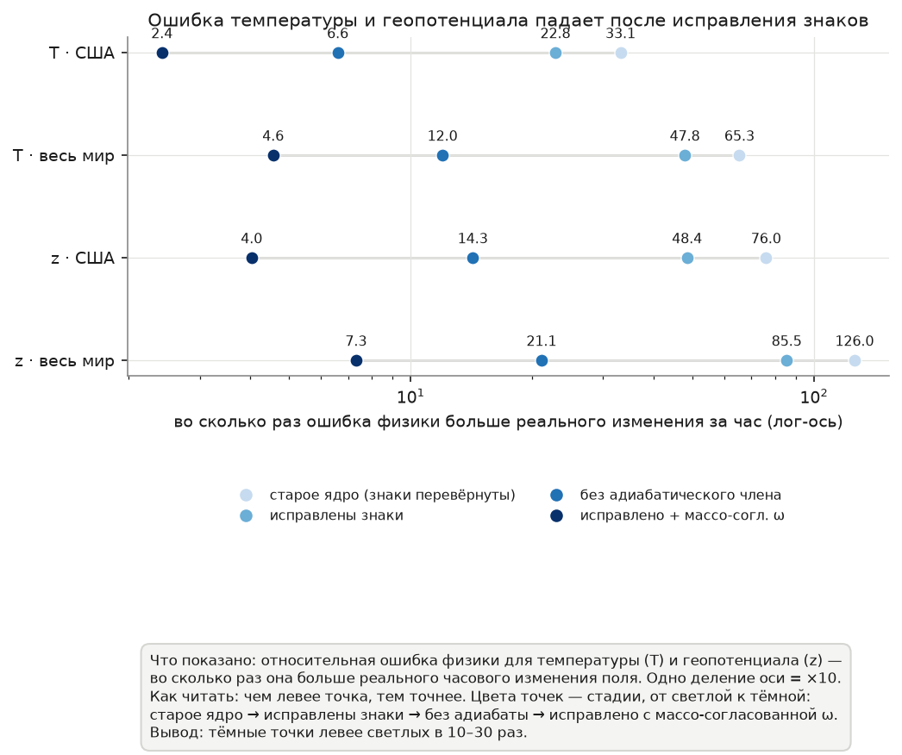
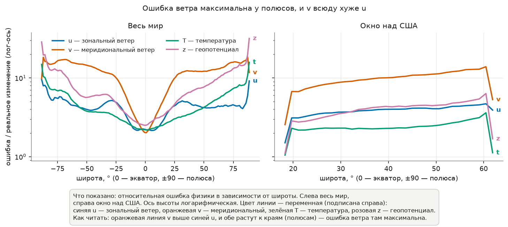
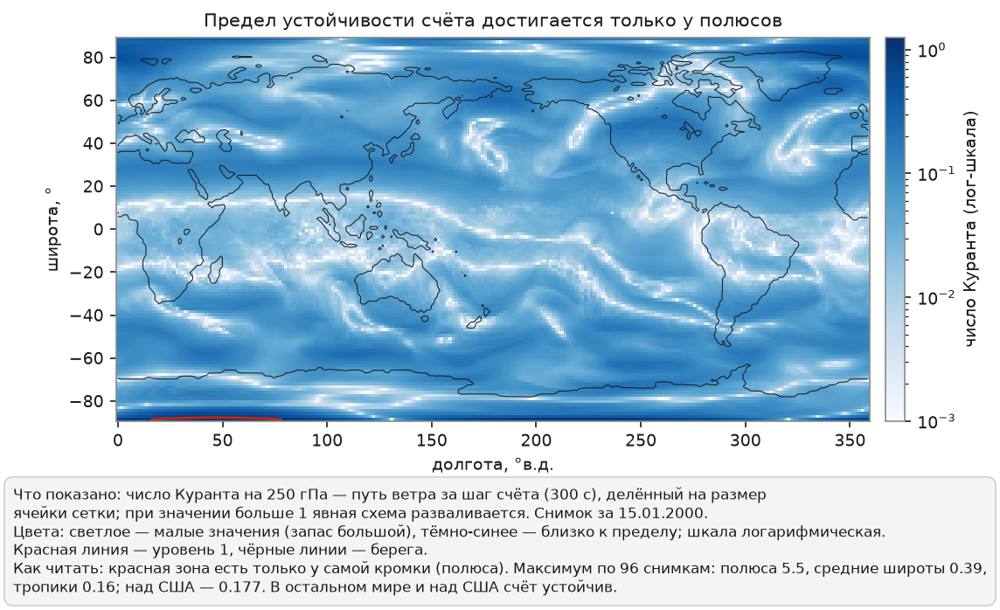
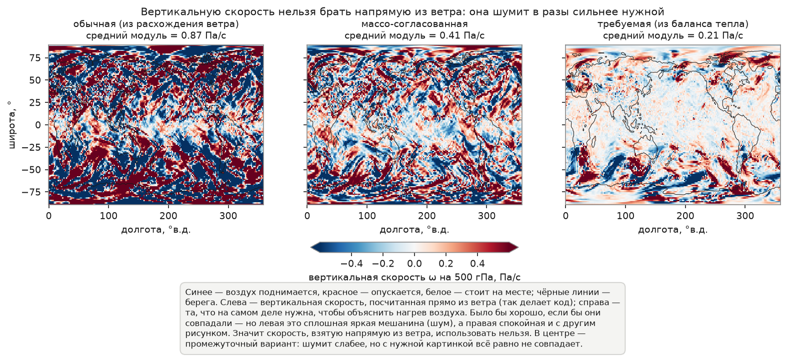
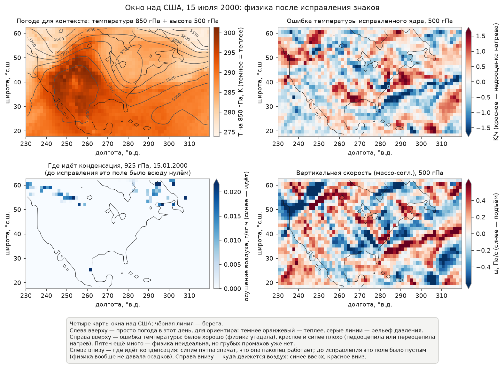

# Проверка физики на данных ERA5 за 2000 год после исправления знаков

Здесь собрана статистика того, насколько хорошо физическое ядро описывает
реальную атмосферу после исправления четырёх знаковых ошибок (правки B1–B4,
разбор — в [README.md](README.md)). Считалось на двух областях: региональное
окно над США и весь земной шар.

## Что и как считалось

- **Данные.** 96 пар соседних по времени часовых снимков ERA5 (сетка 1.40625°),
  равномерно разбросанных по 2000 году. Каждая пара — состояние атмосферы
  «сейчас» и «через час»; по ним мы знаем, как поля реально изменились за час.
- **Две области.** Региональное окно над США (сетка 32×64, широты 18–62° с.ш.)
  и весь земной шар (сетка 128×256).
- **Ядро.** `PurePDEKernel` из `utils/physics.py` — центральные разности,
  сферический параметр Кориолиса, адиабатическая термодинамика — после
  исправлений B1–B4. Поведение «до исправления» воспроизведено формулами
  (перевёрнутые знаки адиабаты и гидростатики, конденсация отключена), чтобы
  сравнить старое и новое ядро на одних и тех же данных.
- **Запуски** на суперкомпьютере cHARISMa (раздел `cpu-e-quick`), задачи
  4169155/4169160/4169164. Итоговые числа —
  [physics_stats_2000_results.json](physics_stats_2000_results.json), поля для
  карт собраны отдельно в NPZ-файл, рисунки строит
  [make_figures.py](make_figures.py).

## Как читать величину невязки

Невязка (residual) показывает, насколько предсказанная физикой скорость
изменения поля расходится с тем, как поле изменилось на самом деле. Мы берём
относительную величину — сумму модулей ошибки, делённую на сумму модулей
реального изменения:

```text
невязка = Σ|реальное изменение за час − предсказание физики| / Σ|реальное изменение за час|
```

Ориентиры простые: значение около **1** означает, что ошибка сравнима с самим
изменением поля (физика по сути не угадывает); значение **10** — ошибка в
десять раз больше сигнала; значение около **0** — физика воспроизводит
изменение точно. Идеальная физика дала бы 0, реальная упрощённая — всегда
больше нуля, и вопрос лишь в том, насколько.

---

## 1. Насколько исправление помогло: температура и геопотенциал



**Что на рисунке 1.** Четыре строки — температура (T) и геопотенциал (z) для
двух областей. В каждой строке слева направо стоят четыре точки, показывающие,
как менялась невязка по мере исправлений (ось внизу — логарифмическая, то есть
каждое деление это умножение на 10): светлая точка справа — исходное ядро с
перевёрнутыми знаками; затем — только исправление знаков; затем — что осталось
бы от невязки, если убрать адиабатический член и оставить один перенос
(адвекцию); тёмная точка слева — исправленное ядро с массо-согласованной
вертикальной скоростью. Чем левее точка, тем меньше ошибка.

| Переменная | США, до исправл. | США, исправл. (обычная ω) | США, исправл. (массо-согл. ω) | Мир, до исправл. | Мир, исправл. (обычная ω) | Мир, исправл. (массо-согл. ω) |
|---|---|---|---|---|---|---|
| u (зональный ветер) | 3.95 | 3.95 | 2.93 | 4.33 | 4.33 | 2.21 |
| v (меридиональный ветер) | 10.15 | 10.15 | 9.97 | 12.01 | 12.01 | 11.54 |
| T (температура) | 33.13 | 22.84 | 2.42 | 65.32 | 47.83 | 4.56 |
| q (влажность) | 1.59 | 1.57 | 1.39 | 2.09 | 2.07 | 1.66 |
| z (геопотенциал) | 76.05 | 48.43 | 4.03 | 126.02 | 85.54 | 7.32 |

Поэтапное снижение невязки температуры (США / мир): было 33 / 65 → после
исправления знаков 22 / 48 → если оставить один перенос без адиабаты 6.6 / 12 →
исправленное ядро с массо-согласованной ω 2.4 / 4.6. Для геопотенциала так же:
76 / 126 → 48 / 86 → 14 / 21 → 4.0 / 7.3.

Отсюда три вывода.

1. Исправление знаков само по себе снижает невязку температуры и геопотенциала
   на 27–36% при любой вертикальной скорости — это прямое подтверждение правок
   B1 и B2 на реальных данных.
2. Вертикальная скорость, посчитанная напрямую из расхождения ветра
   (кинематическая ω, режим «plain»), приносит вред: адиабатический член с ней
   даёт бо́льшую ошибку (22.8), чем полное отсутствие адиабаты (6.6). Причина —
   шум: средний модуль такой ω составляет 0.52 (США) и 0.90 (весь мир) Па/с при
   реальной величине около 0.17 Па/с, и этот шум раскачивает адиабатический
   член.
3. С массо-согласованной вертикальной скоростью (mass-consistent ω, из неё
   вычтено среднее по столбу воздуха) исправленная термодинамика впервые
   полезна: и температура, и геопотенциал описываются в 2.7–2.9 раза точнее
   чистого переноса. Прежний вывод экспериментов 04 и 11 — «невязка всюду
   больше единицы, форма уравнений безнадёжна» — оказался завышен на порядок
   именно для температуры и геопотенциала: настоящий уровень 2.4–7.3, а не
   33–126.

Практическое следствие для обучаемых моделей: режим `mass_consistent` стоит
сделать основным (сейчас массо-согласованная ω включается только в отдельной
конфигурации эксперимента; по умолчанию ядро считает обычную ω).

---

## 2. Разбор трёх аномалий первого запуска

### 2.1 Почему невязка меридионального ветра v вдвое больше зонального u



**Что на рисунке 4.** По горизонтали — широта, по вертикали (логарифмической) —
невязка. Слева весь мир, справа окно над США. Четыре линии — зональный ветер u,
меридиональный ветер v, температура T и геопотенциал z; каждая подписана прямо у
своего конца. Видно, что линия v лежит заметно выше линии u и что обе линии
растут к полюсам (края графика), а не к экватору (центр).

Разбивка по широтным поясам (u, v — обычная ω; T, z — массо-согласованная):

| Пояс | США, u | США, v | Мир, u | Мир, v | Мир, T | Мир, z |
|---|---|---|---|---|---|---|
| Тропики (до 23,5°) | 2.74 | 5.82 | 2.87 | 4.75 | 2.51 | 3.18 |
| Средние широты | 4.05 | 10.51 | 4.43 | 13.06 | 4.10 | 6.84 |
| Полярные (от 66,5°) | — | — | 5.41 | 15.74 | 7.98 | 14.41 |

Асимметрия растёт к полюсам, а не к экватору, поэтому объяснение «в тропиках нет
геострофического баланса» (из эксперимента 05) здесь не подходит. Настоящая
причина — в устройстве уравнения для v. Оно содержит крупную по величине
балансовую пару: сила Кориолиса от сильного зонального ветра (−f·u, где струйное
течение достигает 20–40 м/с) почти уравновешивается меридиональным наклоном
геопотенциала (−∂Φ/∂y). Невязка v — это небольшая разность двух больших чисел
(агеострофический остаток) плюс погрешность численного счёта производных на
сетке. В уравнении для u такой крупной пары нет: среднее значение v близко к
нулю, а зональный наклон геопотенциала без среднего мал.

Часть эффекта на глобусе даёт и несовпадение широт сетки: `Grid` строит их как
равномерную сетку от −90 до 90° (шаг 1,3846°), тогда как ERA5 задан на своей
сетке; расхождение доходит до 0,7°, что вносит около 1,5% систематической
ошибки в производную по широте и в параметр Кориолиса. На региональном окне США
широты заданы точно, поэтому там этого источника нет.

Граница окна ни при чём: если пересчитать невязку по внутренней области (отбросив
по две крайние строки и столбца), числа совпадают с полными в пределах 1–5% (для
u — 3.96 против 3.95, для T — 23.3 против 22.8). Это согласуется с выводом
эксперимента 06 о том, что граничные условия влияют слабо.

### 2.2 Число Куранта доходит до 5,5 у полюсов



**Что на рисунке 5.** Карта мира — число Куранта (CFL, отношение расстояния,
которое ветер проходит за шаг по времени, к размеру ячейки сетки) на уровне
250 гПа при шаге 300 секунд. Шкала логарифмическая, светлое — малые значения,
тёмно-синее — большие. Чёрные линии — очертания материков. Красная линия отмечает
уровень CFL = 1, за которым явная схема интегрирования становится неустойчивой;
она появляется только в самых верхних (приполярных) рядах карты. Внизу подписаны
максимумы по всем 96 парам снимков.

Это чисто полярный дефект регулярной широтно-долготной сетки: у полюсов ячейки по
долготе сжимаются, и одна и та же скорость ветра даёт огромное число Куранта.
Максимум по поясам (шаг 300 с): тропики 0,16, средние широты 0,40, полярные 5,46;
на окне США — 0,083. То есть чистая физика на всём земном шаре при шаге 300 с
нарушает устойчивость только у полюсов (лечится полярным фильтром из
`utils/physics.py` или полунеявной схемой). На региональном окне США запас по
устойчивости двенадцатикратный, и прежняя неустойчивость там была вызвана
знаковыми ошибками (теперь исправлены) и явной схемой Эйлера на волновых
движениях, а не числом Куранта.

### 2.3 Вертикальная скорость и миф о «диабатике в 48 раз»



**Что на рисунке 2.** Три карты мира — вертикальная скорость ω на уровне 500 гПа
на 15 июля 2000 года. Слева — обычная кинематическая ω (из расхождения ветра); в
центре — массо-согласованная (из неё вычтено среднее по столбу); справа — та ω,
которая была бы нужна, чтобы точно объяснить наблюдаемое изменение температуры
(«требуемая» ω из теплового баланса). Цвет расходящийся: синее — подъём, красное —
опускание, белое — ноль. Над каждой картой подписан средний модуль скорости.
Хорошо видно, что левая карта пёстрая и «шумная» с большими амплитудами, средняя
слабее по амплитуде, а правая (требуемая ω) выглядит совсем иначе — узоры не
совпадают.

| Показатель | США | Мир | Эксп. 10 (до исправл., 2003) |
|---|---|---|---|
| Совпадение обычной ω с требуемой (корреляция) | −0.001 | +0.014 | ≈0.001 |
| Совпадение массо-согл. ω с требуемой | +0.018 | +0.019 | — |
| Средний \|ω\| обычная / массо-согл., Па/с | 0.52 / 0.15 | 0.90 / 0.25 | 0.92 / 0.25 |
| Средний \|ω\| требуемая, Па/с | 0.168 | 0.165 | 0.009 (занижено, см. ниже) |
| Остаточный нагрев Q к адиабате | 0.82 / 0.66 | 0.85 / 0.66 | «×48» |

Совпадение кинематической ω с требуемой близко к нулю даже после исправления и
даже для массо-согласованной версии. Это подтверждает структурный вывод
эксперимента 10: на такой грубой сетке вертикальная скорость, полученная из
расхождения ветра, не несёт поточечного сигнала. Выигрыш массо-согласованной
версии — от подавления амплитуды шума (0,90 → 0,25), а не от улучшения
совпадения.

Заодно в эксперименте 10 нашлась своя ошибка: там при вычислении требуемой ω
величину `d_z(t)` использовали как ∂T/∂p в единицах на Па, тогда как `d_z` даёт
−∂/∂p в единицах на гПа (перепутаны знак и множитель 100). Поэтому их оценка
среднего требуемого \|ω\| = 0,009 Па/с занижена; правильная величина около
0,165 Па/с.

Отсюда же опровержение громкого вывода «диабатический нагрев в 48 раз больше
адиабатического». С исправленными знаками остаточный нагрев Q (то, что уравнения
не объясняют: излучение, скрытое тепло конденсации, потоки тепла) сопоставим с
адиабатическим членом — 0,66–0,85 от него, а не в 48 раз больше. Прежняя оценка
включала удвоенную амплитуду перевёрнутого адиабатического члена. Диабатического
нагрева в ядре по-прежнему нет, и он важен, но его масштаб пересмотрен вниз
примерно на полтора-два порядка.

### 2.4 Гидростатика и конденсация ожили



**Что на рисунке 3.** Четыре карты окна над США. Слева вверху — состояние
атмосферы для контекста: цветом температура на 850 гПа (оранжевое теплее), серыми
линиями — изогипсы геопотенциала на 500 гПа (высота в геопотенциальных метрах);
хорошо видны тёплый юго-запад и наклон изогипс с юга на север. Справа вверху —
невязка температуры исправленного ядра на 500 гПа (расходящаяся шкала, красное —
физика недооценила нагрев, синее — переоценила). Слева внизу — конденсационное
осушение воздуха на 925 гПа за 15 января (синее — где идёт конденсация; до
исправления B3 это поле было тождественным нулём). Справа внизу —
массо-согласованная вертикальная скорость на 500 гПа. Чёрная линия на всех
картах — берега материков.

Два измеримых результата.

- Геопотенциал, восстановленный по наблюдаемому изменению температуры, теперь
  совпадает по знаку с реальным: корреляция +0,37 (США) и +0,35 (весь мир) при
  отношении амплитуд около единицы (1,15 и 0,99). В эксперименте 10 корреляция
  была −0,35 — знак восстановлен правкой B2. Отношение амплитуд около единицы
  подтверждает вывод эксперимента 10, что отдельно прогнозировать геопотенциал
  избыточно: он почти полностью определяется температурой.
- Конденсация после правки B3 работает и даёт физичные значения: насыщено 3,6%
  точек над США и 5,9% по миру, условие конденсации срабатывает на 1,8% и 2,9%
  точек, средний источник влаги 5,6·10⁻¹⁰ и 1,0·10⁻⁹ кг/кг за секунду, что
  составляет 2–3% от переноса влаги. До исправления источник был тождественным
  нулём, потому что восстановленное давление получалось отрицательным
  (−14,8 Па), и насыщающая влажность обрезалась до 10⁻⁶.

---

## 3. Что делать дальше (по важности)

1. Сделать массо-согласованную вертикальную скорость (`mass_consistent`)
   основным режимом физического приора для температуры и геопотенциала: обычная
   ω приносит вред.
2. Приоритеты улучшений сместились. Главный резерв — качество вертикальной
   скорости (уравнение для ω или обучаемая диагностика): это до десятикратного
   выигрыша по температуре и геопотенциалу. Диабатический нагрев Q даёт фактор не
   больше двух, а не сорок восемь. Худшая переменная теперь — ветер, особенно
   меридиональный v; кандидаты на разбор — точные широты сетки на глобусе, члены
   кривизны сферы, агеострофический остаток.
3. Чистая физика на окне США по числу Куранта безопасна при шаге 300 с; для
   всего земного шара нужен полярный фильтр. Пересмотр эксперимента 07 после
   исправления знаков теперь осмыслен.
4. Обучаемые конфигурации версии v4, обученные до исправления, получали от
   физики сигнал с неверным знаком по температуре и геопотенциалу. Для честного
   сравнения их нужно переобучить на исправленном ядре.

## 4. Как воспроизвести

```bash
REMOTE_REPO=/home/fa.buzaev/WeatherPredictions \
  bash sh_files/remote_submit.sh sh_files/physics_stats_2000_cpu.sh
# быстрая локальная проверка на синтетике:
# OUT=/tmp/x.json SYNTHETIC=1 N_PAIRS=2 python physics_stats_2000.py
```
