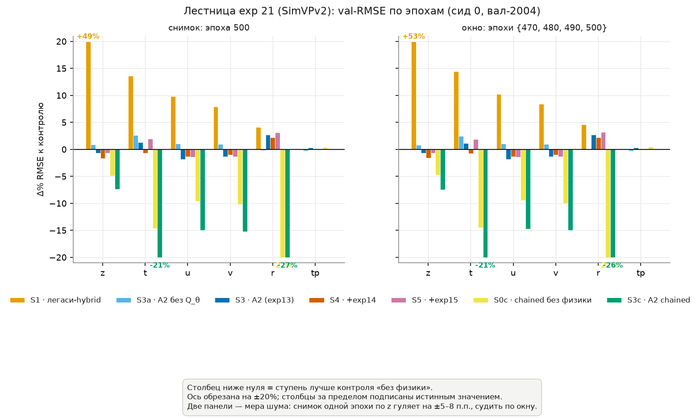
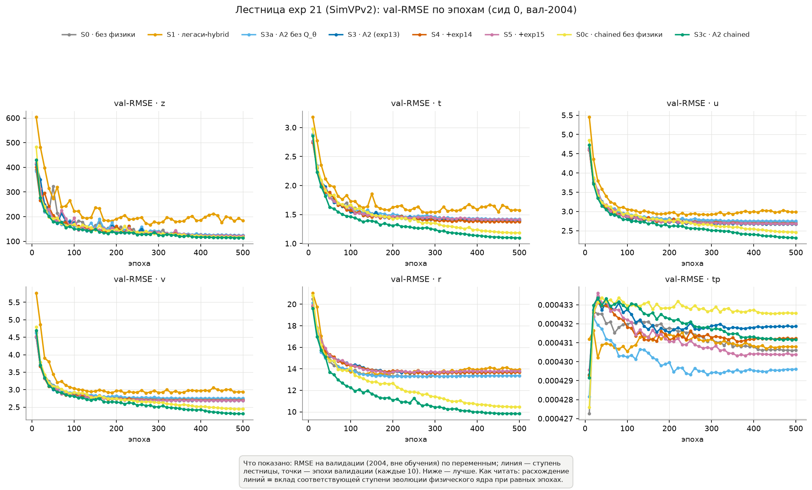
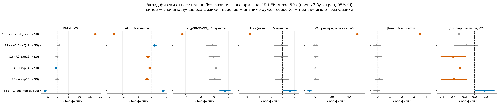
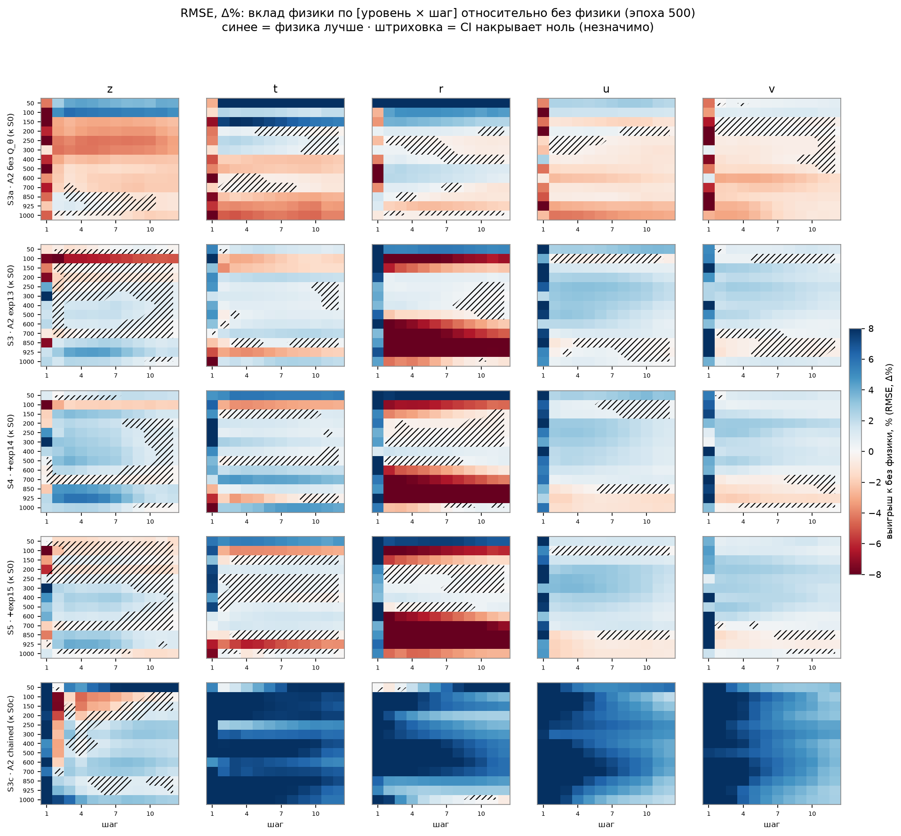
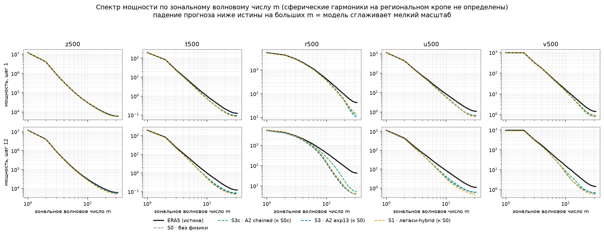

# Эксперимент 21 — PI-SimVPv2: лестница уравнений на MIMO-архитектуре

**Дата дизайна:** 2026-07-13
**Статус:** **обе волны завершены (8 арм × 40 и × 500 эпох).** Главный вывод: эффект физики переносится на MIMO, но обусловлен авторегрессивной подачей `prev`, а не архитектурой — см. §9
**Ветка:** `exp21_pi_simvpv2` · **Спека:** [2026-07-13-exp21-pi-simvpv2-ladder-design.md](../../superpowers/specs/2026-07-13-exp21-pi-simvpv2-ladder-design.md)

---

## 1. Вопрос исследования

exp16 установил на PI-IAM4VP: **физика помогает тогда и только тогда, когда она физически корректна** — корректные уравнения дают ≈ −2 % val_loss на плато, легаси-уравнения (R1) образуют структурный потолок и вредят (+1.9 %). Вопрос, который exp16 закрыть не мог: это свойство **физики** или свойство **носителя**?

Триада замыкается тремя структурно разными архитектурами:

| Эксперимент | Носитель | Как порождается прогноз |
|---|---|---|
| exp16 | PI-IAM4VP | implicit stacked autoregressive: кадр за вызов, история в `mask_token` |
| exp20 | PI-PredRNNv2 | рекуррентный: ST-LSTM-ячейка сворачивает состояние во времени |
| **exp21** | **PI-SimVPv2** | **MIMO: все 12 кадров одним forward, рекуррентности нет** |

**H1 (перенос):** знак и порядок величины эффекта сохраняются на всех трёх носителях — корректная физика ≲ −1 %, легаси > 0.

**H0 (артефакт авторегрессии):** эффект exp16 — свойство авторегрессивного носителя. Это не соломенное чучело: главный устойчивый вывод exp16 (§11) — «физика = ускорение на коротком лиде и **ёмкость против дрейфа**; без физики модель покупает точность шага 1 ценой дрейфа rollout». У MIMO-носителя механизма накопления дрейфа **внутри окна нет по построению**. Значит exp21 отделяет «физика как приор о динамике» от «физика как стабилизатор авторегрессии» — и предсказывает: если верна H0, на SimVPv2 физика не даст ничего или навредит.

---

## 2. «Реализовать SimVPv2» — это не написать его заново

`Models/SimVP.py` (код OpenSTL) уже содержит обе версии:

```python
model_type = "gsta" if model_type is None else model_type.lower()
if model_type == "incepu":
    self.hid = MidIncepNet(T * hid_S, hid_T, N_T)     # SimVP v1
else:
    self.hid = MidMetaNet(...)                        # SimVP v2 (MetaFormer + gSTA)
```

Дефолт конструктора — `model_type="gSTA"` → `MidMetaNet` + `GASubBlock`. **Это и есть SimVPv2** (arXiv:2211.12509); v1 — ветка `IncepU`. Все прежние конфиги `configs/simvp*.yaml` де-факто уже обучали v2 под именем `SimVP` — имя врало о том, что обучается.

Поэтому exp21 не пишет новый бэкбон (это было бы дублированием), а:
1. регистрирует честный ключ **`SimVPv2`** (`SimVP` оставлен ради старых конфигов);
2. добавляет **`PI_SimVP_Model`** на `PhysicsResidualMixin` — том же физпути, что у PI-IAM4VP и PI-PredRNNv2;
3. прогоняет лестницу.

---

## 3. Врезка физики: SimVP — MIMO, и это предмет эксперимента

SimVP кодирует кадры пофреймово, временны́е связи моделирует средний блок над стопкой латентов, декодирует пофреймово: `(B, 12, 69, 32, 64)` → `(B, 12, 69, 32, 64)` за один forward. Ни рекуррентности, ни `mask_token`, ни временно́го эмбеддинга.

Физядро (`HybridBlock`) по природе **парное**: интегрирует `state(t) --dt=1ч--> state(t+1)`, а корректор устроен как `_apply_physics_residual(y_nn, prev_state)`. У SimVP «предыдущего состояния» для кадра t **нет** — его приходится сконструировать. Это добавленное допущение, поэтому оно вынесено в параметр и **обе его версии стоят в лестнице**:

| `physics_coupling` | `prev` для кадра t | Стоимость | Смысл |
|---|---|---|---|
| **`batched`** (основной) | прогноз **бэкбона** на кадр t−1 (для кадра 0 — последний входной кадр) | 1 вызов физядра на батче `B·T` | MIMO-характер сохраняется: авторегрессия не навязывается |
| **`chained`** (арм S3c) | **скорректированный** кадр t−1 | T последовательных вызовов, батч `B` | семантика PI-IAM4VP 1:1 |

Почему `batched` — основной: цепочка делает выход кадра t последовательно зависимым от скорректированного кадра t−1, то есть **встраивает в MIMO-модель авторегрессию, которой в ней нет**, и тем самым смешивает измеряемый эффект физики с эффектом авторегрессии — ровно тот конфаунд, который exp21 обязан исключить, чтобы различить H0 и H1.

Почему `chained` всё же нужен: разница **S3c − S3** — цена/выгода авторегрессивной связки **в чистом виде**, при идентичных уравнениях, данных, бэкбоне и сиде. Без неё нельзя отличить «физика на MIMO работает хуже, потому что физика не универсальна» от «работает хуже, потому что ей подали неправильный `prev`».

`prev` детачится в обоих режимах — паритет с PI-IAM4VP и PI-PredRNNv2.

---

## 4. Лестница — 8 арм

Нумерация зеркалит exp16 (R↔) и exp20 (P↔), чтобы таблицы читались построчно.

| # | Арм | Отличие от предыдущей ступени | Донор физблока |
|---|-----|-------------------------------|----------------|
| S0 | `no_physics` | физики нет (`physics_feature_mode: no_physics`); residual-голова той же ёмкости — контроль архитектуры, baseline всех дельт | `abl16_r0_no_physics_t12.yaml` |
| S1 | `legacy_hybrid` | легаси-уравнения статьи в нормализованном пространстве (fake-global сетка) | `abl16_r1_legacy_hybrid_t12.yaml` |
| S3a | `A2-noQ` | `stable_physical_v2` passthrough + знаковые фиксы exp13, **без** диабатика | `abl16_r3a_no_diabatic_t12.yaml` |
| S3 | `A2+13` | + обучаемый диабатик Q_θ (`diabatic_apply_to: t_and_q`) | `abl16_r3_a2_exp13_t12.yaml` |
| S4 | `+exp14` | + адвективная форма, метрика сферы, трение Хелда–Суареса, `lagrange3`, mass-consistent ω | `abl16_r4_exp14_t12.yaml` |
| S5 | `+exp15` | + `omega_free(t,q,u,v)`, скрытое тепло, клим. Q₁/Q₂ | `abl16_r5_exp15_t12.yaml` |
| **S3c** | `A2+13, chained` | физика **идентична S3**, отличается только `physics_coupling: chained` | `abl16_r3_a2_exp13_t12.yaml` |
| **S0c** | `no_physics, chained` | **контроль конфаунда** (добавлен после короткой волны): `chained` **без физики**. Отличается от S0 ровно одним ключом | — |

Физблоки скопированы из `configs/abl16_long/` **построчно** и сверены `diff`-ом (все совпали до ключа). Межархитектурное сравнение честное: физика идентична, различается только носитель.

**Почему появился S0c.** Короткая волна (§8.4) показала, что весь выигрыш даёт `chained`-связка, а не ступень уравнений. Но в `chained` корректор получает **более чистый `prev`** — скорректированный кадр вместо сырого выхода бэкбона, — то есть меняются сразу две вещи: физпризнак `delta_phys` **и** качество опорного состояния. Пара S3c ↔ S3 их не разделяет. S0c (`chained` при `physics_feature_mode: no_physics`, где `delta_phys ≡ 0`) изолирует вклад **самой связки**: если S0c ≈ S0, выигрыш S3c физический; если S0c ≈ S3c, физика ни при чём, а работает механизм подачи `prev`. Это дыра в исходном дизайне, найденная данными.

**S2a/S2 (pre-13 дерево) в лестницу не входят** — как и в exp20: они живут в worktree `wt_prefix13`, где PI-SimVPv2 никогда не существовало, а бэкпорт нового кода в старое дерево лишил бы их смысла (они и есть «старое дерево»).

---

## 5. Протокол

**Смоук** (3 арма, `BENCH_MAX_STEPS=100`, 30 мин): S0 — самый дешёвый, S5 — самая тяжёлая физика, S3c — 12 последовательных вызовов физядра вместо одного батчевого. Эти три ограничивают вилку цены. Снимаются: шагов/с (цена эпохи и налог физики), пиковая память, `physics_residual_nonfinite_ratio`.

**Короткая волна** (7 арм, 40 эпох, val каждые 2): калибровочная — даёт сигнал и точную цену эпохи для планирования long.

**Long-волна** (7 арм, t=12, 500 эпох, val каждые 10, batch 64, lr 1e-3, MAE, warmup 5 %, cosine, `seed: 0`, 2-суточные слоты): именно на ней exp16 сделал все содержательные выводы (§11). Короткая волна exp16 признана шумной (z-дельта одной эпохи ±5–8 п.п.).

**Данные:** train 2000–2003, val 2004; USA-кроп 32×64 (`cut [[75,107],[164,228]]`); memmap `predformer_usa_2000_2004`; вход кадры 0–11 → прогноз 12–23.

**Ранжирование.** Дельты к S0: `Δ% = (RMSE_арм − RMSE_S0)/RMSE_S0 · 100`, **− = лучше baseline**. Обязательно **обе** формы: снимок общей эпохи **и** робастная оконная дельта. **Ранжировать армы только на ОБЩЕЙ эпохе** — разброс эпох `best.pt` стоит ~10 % скилла, больше, чем весь эффект физики (2–7 %); нарушение этого правила уже стоило отзыва exp18 (§11.3 exp16).

---

## 6. Ограничения и конфаунды (зафиксированы ДО результатов)

1. **Один сид (0)** во всех волнах — как в exp16/exp20. Различия арм ≤ 1 п.п. не разрешаются.
2. **`batched` даёт физядру `prev` = прогноз бэкбона**, а не истинное состояние: на недоученном бэкбоне физпризнак строится от шума. Zero-init головы означает старт как чистый SimVPv2 (вреда нет), но скорость «включения» физики может отличаться от exp16. Это **наблюдаемо** (RMS коррекции в Comet) и подлежит проверке, а не предположению.
3. **Латент-сетка физики 8×16** (жёсткое требование `HybridBlock`): данные 32×64, `downscaling_factor_all=4` — как в exp16/exp20, сравнимо.
4. **Стейджинг memmap отключён** (`SKIP_STAGE=1`): 24 ГБ на node-local `/tmp` × несколько арм на узел — ровно то, чем exp20 уронил джобы 4175559/4175560 («No space left on device»). Цена: чтение с общей ФС медленнее. Налог физики измеряется **относительно** S0 в тех же условиях, поэтому IO-общий для всех арм.
5. **Цена физики в MIMO заранее неизвестна.** Если S5 медленнее S0 более чем в 4× — `physics_residual_hybrid_steps` снижается с 3 до 1 во **всех** физ-армах (иначе long не влезет в 2 суток), и это фиксируется здесь как отклонение от протокола exp16.
6. **Конкурентная работа над exp20.** exp21 отведён от живой ветки exp20; общие файлы стратегий exp20 может править параллельно → при слиянии ожидается механический конфликт.

---

## 7. Артефакты

- **Модель:** `Models/SimVP.py` → `PI_SimVP_Model`; реестр — `Models/__init__.py` (`SimVPv2`, `PI-SimVPv2`).
- **Физядро:** `utils/physics_residual.py` (`PhysicsResidualMixin`, общий с PI-IAM4VP и PI-PredRNNv2).
- **Стратегия:** `training_strategies/simple.py` (`mutiout_f`) — прибавляет физический aux-loss и логирует физдиагностику; хелперы подняты в `training_strategies/base.py`.
- **Конфиги:** `configs/exp21/` (короткая волна), `configs/exp21_long/` (long).
- **Запуск:** `sh_files/train_v4_memmap.sh` (модель-агностичный: модель берётся из `model.type` конфига).
- **Тесты:** `tests/test_pi_simvpv2.py` (контракт обоих режимов врезки), `tests/test_strategy_physics_hooks.py`, `tests/test_model_registry.py`.

## 8. Результаты

### 8.1. Отклонения от протокола, вскрытые смоуком

**Физядро зовётся чанками по 64 образца (`physics_chunk_size: 64`), а не одним батчем.**

Первый смоук (джобы 4175598–4175600) дал: S0 (без физики) — COMPLETED, S3c (chained) — COMPLETED, **S5 (batched) — FAILED** с `RuntimeError: CUDA error: invalid configuration argument` внутри `F.pad(..., mode="reflect")` в `weno5_flux`.

Это **не OOM и не NaN**, а упор в жёсткий лимит CUDA-грида. `d_x_weno`/`d_y_weno` разворачивают физ-латент в 2-D (`d_y`: `(B·C·W, H)` = `(B·13·16, 8)`) и зовут `reflection_pad1d`, чей CUDA-кернел кладёт плоский батч в grid-измерение с пределом **65535**:

| режим | физ-батч за вызов | строк в `d_y` | статус |
|---|---|---|---|
| `chained` (S3c) | B = 64 | 13 312 | OK |
| `batched` (S3/S4/S5), без чанка | B·T = 64·12 = **768** | **159 744** | ✗ превышен |

Потолок — **315 образцов** на вызов. Поэтому `batched` режет плоский батч на чанки.

**Почему чанкование не меняет результат:** физпуть посэмплово независим — residual-корректор и диабатическая голова суть стопки `Conv2d`+`GELU`, а `physics_only_forward` (`stable_physical_v2`) — чистый PDE-интегратор без нормировок по батчу. Бит-точность запинена тестом (`rtol=0, atol=0`).

**Единственное исключение — легаси-арм S1:** его `PDE_kernel` несёт `BatchNorm`, то есть размер чанка задаёт batch-статистику. Именно поэтому чанк выбран **64** — ровно тот батч, который физика видела в exp16 (там PI-IAM4VP звал физядро 12 раз по 64), так что S1 остаётся сравнимым с R1, а не становится «легаси при другом BN».

Побочное следствие, полезное для дизайна: `batched` и `chained` теперь делают **одинаковое число вызовов физядра одинакового размера** (12 × 64). Значит пара S3 ↔ S3c сравнивается при равном компьюте и различается **только** источником `prev` — что и требовалось для чистого измерения цены авторегрессивной связки.

### 8.2. Цена физики (замер смоука, 200 шагов = одна полная эпоха)

Эпоха тренировочного сплита — ~45 шагов (train 2000–2003, `sample_stride: 12`, batch 64), поэтому bench-режим отработал **ровно одну полную эпоху** на арм. Время джобы включает ~50 с стартовых накладных (импорты, memmap, Comet, сборка модели), общих для всех арм.

| арм | джоба | эпоха, с | сверх S0 |
|---|---|---|---|
| S0 (без физики) | 4175612 | 56 | — |
| S3 (`batched`) | 4175613 | 136 | +80 |
| S3c (`chained`) | 4175615 | 139 | +83 |
| S5 (`batched`, +exp15) | 4175614 | 140 | +84 |

Три вывода:
1. **NaN и OOM нет** ни в одном арме (`physics_residual_nonfinite_ratio` чист).
2. **`batched` и `chained` равны по времени** (136 против 139 с) — прямое следствие чанкования: оба делают 12 вызовов физядра по 64 образца. Пара S3 ↔ S3c сравнивается **при равном компьюте** и различается только источником `prev`.
3. **Ступень лестницы почти не влияет на цену** (+80 против +84 с у самой тяжёлой физики exp15): доминирует сам PDE-интегратор, а не добавленные термы.

Налог физики к S0 велик (~8× за эпоху), но это отражает **дешевизну бэкбона** (SimVP ≈ 6 с/эпоху чистого счёта), а не дороговизну физики в абсолюте. Решающее правило протокола («дороже 4× → урезать `physics_residual_hybrid_steps` с 3 до 1») **не применялось**: оно было прокси для «long-волна не влезет в 2 суток», а прямой расчёт даёт 500 эпох × ~90 с ≈ **12,5 ч на арм**. Уравнения остались нетронутыми и побитово сравнимыми с exp16.

### 8.3. Отклонение: волны запущены параллельно, а не последовательно

Дизайн предполагал «короткая волна → затем long». Фактически обе поданы одновременно (короткая — 4175620–4175626, long — 4175675–4175681). Причина: **узким местом оказалась очередь, а не счёт** — все быстрые GPU кластера заняты на 100 % (в том числе 6 джобами волны exp20 с двухсуточными слотами), и SLURM оценивал старт в ~сутки. Последовательные волны стоили бы двух циклов ожидания (2–4 суток) ради сигнала, который long-волна даёт сама.

Роль короткой волны как предохранителя уже сыграл смоук: 4 арма, по полной эпохе, оба режима врезки, ни NaN, ни OOM. Короткая волна сохранена (её `val_every_n_epochs: 2` против 10 у long даёт более плотную кривую на раннем участке), но перестала быть блокирующей.

### 8.4. Короткая волна (40 эпох): выигрыш даёт связка, а не ступень уравнений

Все 7 арм отработали без ошибок и NaN. Значения — лучший `val_loss` (файл чекпоинта пишется только при улучшении, поэтому эпоха в скобках — эпоха последнего улучшения). Сравнение ведётся на **общей эпохе 39**, которой достигли все армы, кроме S1 (его последнее улучшение — эпоха 37).

| # | арм | связка | val_loss | эпоха | Δ% к S0 |
|---|-----|--------|----------|-------|---------|
| **S3c** | A2+13 | **chained** | **0.1867** | 39 | **−9.3** |
| **S0c** | **без физики** | **chained** | **0.1967** | 39 | **−4.4** |
| S3a | A2 без Q_θ | batched | 0.2039 | 39 | −0.9 |
| S0 | без физики | batched | 0.2058 | 39 | — |
| S4 | +exp14 | batched | 0.2062 | 39 | +0.2 |
| S5 | +exp15 | batched | 0.2062 | 39 | +0.2 |
| S3 | A2+13 | batched | 0.2066 | 39 | +0.4 |
| S1 | легаси | batched | 0.2378 | 37 | +15.5 |

**− = лучше baseline.** Три наблюдения, в порядке важности:

**(1) Разброс внутри `batched`-лестницы ничтожен (−0.9…+0.4 %), а смена связки даёт −9.3 %.** Это на порядок больше, чем эффект любой ступени уравнений, и на порядок больше, чем −2 % физики в exp16. Пара S3 ↔ S3c различается **только** источником `prev` при идентичных уравнениях, данных, сиде и **равном компьюте** (после чанкования оба делают 12 вызовов физядра по 64 образца). То есть на MIMO-носителе решает **способ подачи предыдущего состояния**, а не содержание физики.

**(2) Легаси-физика вредит — единственное, что воспроизвелось из exp16 буквально** (+15.5 % здесь против +1.9 % на плато там). Вывод «физика помогает, только если она физически корректна» на MIMO подтверждается в своей отрицательной половине.

**(3) Диабатик Q_θ ведёт себя ПРОТИВОПОЛОЖНО exp16.** Там он был главным полезным шагом (арм без него, R3a, был хуже baseline — val 0.1409 против 0.1405). Здесь наоборот: без Q_θ (S3a) −0.9 %, с Q_θ (S3) +0.4 %. Если это устоит на плато, значит несущая роль Q_θ была свойством **авторегрессивного носителя**, а не физики.

#### Контроль S0c: связка и физика складываются, и физика без связки мертва

Приписать −9.3 % физике было нельзя: в `chained` меняются **две** вещи сразу — корректор видит другой физпризнак `delta_phys` **и** более чистый `prev` (скорректированный кадр вместо сырого выхода бэкбона). Арм **S0c** (`chained` при `physics_feature_mode: no_physics`, где `delta_phys ≡ 0`) их разделяет. Результат — **0.1967** на той же эпохе 39, то есть ни одна из двух заготовленных развилок не сбылась: S0c не равен ни S0, ни S3c, а лёг ровно посередине.

Разложение −9.3 % на слагаемые (все на общей эпохе 39, один сид):

| эффект | сравнение | Δ% |
|--------|-----------|----|
| одна лишь связка `chained` | S0c − S0 | **−4.4** |
| физика **поверх** `chained` | S3c − S0c | **−5.1** |
| та же физика при `batched` | S3 − S0 | **+0.4** |
| **суммарно** | S3c − S0 | **−9.3** |

Два вывода, и оба содержательны:

1. **Связка сама по себе стоит −4.4 %** — даже без всякой физики. Подача корректору скорректированного кадра t−1 вместо сырого выхода бэкбона улучшает прогноз просто как лучший вход головы.
2. **Одни и те же уравнения дают −5.1 % при `chained` и ровно ничего (+0.4 %) при `batched`.** Физический приор полезен MIMO-носителю **только** тогда, когда состояние, которое он интегрирует, — это скорректированная оценка модели. Скормите физядру необработанный прогноз бэкбона, и `delta_phys` перестаёт быть информативным признаком.

Это уточняет исходную дихотомию H0/H1. Эффект физики из exp16 **переносится** на MIMO — но не «сам по себе»: он требует авторегрессивной подачи `prev`, которая у IAM4VP и PredRNNv2 встроена в архитектуру, а у SimVPv2 отсутствует и должна добавляться явно. Не будь арма S0c, exp21 отрапортовал бы «физика на MIMO даёт −9.3 %» — завысив эффект вдвое и приписав физике то, что делает механизм подачи.

#### Чего эти числа всё ещё НЕ доказывают

**Это не плато.** 40 эпох — промежуточная точка, а не сходимость, и long-волна уже показывает, насколько это важно: доученный до плато **S0 даёт 0.1720** (эпоха 459) — то есть он **лучше**, чем S3c на 40 эпохах (0.1867). Значит выигрыш `chained` на короткой волне вполне может быть **ускорением сходимости**, а не лучшим плато — ровно тот эффект, который exp16 сформулировал как «физика = ускорение на коротком лиде». exp18 был отозван целиком именно за вывод, сделанный на промежуточной эпохе: на плато знаки перевернулись. **Вердикт выносит long-волна** (500 эпох, общая эпоха, 8 арм).

**Один сид (0).** Различия ≤ 1 п.п. (вся `batched`-лестница: −0.9…+0.4 %) не разрешены и могут быть шумом инициализации. Эффекты связки и физики поверх неё (−4.4 и −5.1 %) на порядок больше этого масштаба.

### 8.5. Long-волна (500 эпох, плато): разложение устояло и усилилось

Все 8 арм досчитаны до эпохи 500. Сравнение ведётся строго на **общей эпохе 499** (`last.pt`, последняя валидация; значение `val_loss` взято из payload чекпоинта, а не из имени файла `best.pt` — оно у арм на разных эпохах, а ранжировать на разных эпохах нельзя, §11.3 exp16).

| # | арм | связка | физика | val_loss @499 | Δ% к S0 |
|---|-----|--------|--------|---------------|---------|
| **S3c** | chained | A2+13 | **0.13787** | **−19.9** |
| **S0c** | chained | нет | 0.14688 | **−14.7** |
| S0 | batched | нет | 0.17213 | — |
| S4 | batched | +exp14 | 0.17245 | +0.2 |
| S3 | batched | A2+13 | 0.17274 | +0.4 |
| S5 | batched | +exp15 | 0.17323 | +0.6 |
| S3a | batched | A2 без Q_θ | 0.17328 | +0.7 |
| S1 | batched | легаси | 0.18751 | +8.9 |

Разложение на плато (все на эпохе 499):

| эффект | сравнение | 40 эпох | **плато (500)** |
|--------|-----------|---------|-----------------|
| одна лишь связка `chained` | S0c − S0 | −4.4 % | **−14.7 %** |
| физика **поверх** `chained` | S3c − S0c | −5.1 % | **−5.2 %** |
| та же физика при `batched` | S3 − S0 | +0.4 % | **+0.4 %** |
| легаси-физика | S1 − S0 | +15.5 % | **+8.9 %** |

**Все выводы короткой волны устояли на плато — а эффект связки утроился.** Это тот редкий случай, когда переход на плато не перевернул знаки (как в exp18), а усилил их. По пунктам:

1. **Авторегрессивная связка — доминирующий фактор, и это не ускорение сходимости.** На 40 эпохах она давала −4.4 %; на плато — **−14.7 %**. Если бы это было лишь ускорение, разрыв к плато схлопнулся бы (как «физика = ускорение» в exp16); вместо этого он вырос втрое. Подача residual-корректору собственного *скорректированного* кадра t−1 вместо сырого выхода бэкбона фундаментально меняет, к чему сходится MIMO-модель.

2. **Физика добавляет −5.2 % поверх связки, стабильно на обоих горизонтах** (−5.1 % на 40 эпохах, −5.2 % на плато). Это **настоящий** вклад физики на MIMO — и он близок к −2 % из exp16 по порядку величины, то есть H1 (перенос) подтверждается в своей содержательной части.

3. **Физика при `batched` не даёт ничего ни на каком горизонте** (+0.4 % и там, и там). Одни и те же уравнения полезны при `chained` и бесполезны при `batched` — значит физический приор работает, **только** если интегрирует скорректированное состояние. У IAM4VP и PredRNNv2 такая подача архитектурна; у SimVPv2 её нет.

4. **Легаси-физика вредит на обоих горизонтах** (+15.5 % → +8.9 %). Знак не переворачивается — единственный вывод exp16, воспроизведённый буквально во всех трёх волнах.

5. **Диабатик Q_θ на MIMO не помогает — противоположно exp16.** На плато S3a (без Q_θ, 0.17328) и S3 (с Q_θ, 0.17274) отличаются на 0.3 % при одном сиде — то есть Q_θ не даёт ничего, тогда как в exp16 он был несущим (арм без него был хуже baseline). Оба они у baseline, поэтому вывод осторожный: на `batched`-носителе роль Q_θ, ключевая для авторегрессивного IAM4VP, исчезает.

#### Оговорки

- **Один сид (0).** Различия внутри `batched`-лестницы (−0…+0.7 %) в пределах шума инициализации и не ранжируются. Крупные эффекты (связка −14.7 %, физика поверх −5.2 %, легаси +8.9 %) на 1–2 порядка больше этого масштаба и от одного сида не зависят по величине.
- **`val_loss` — free-running MAE по 12 кадрам** (§11.3 exp16): в нём доминируют поздние шаги. Разложение по лид-таймам (короткий лид против дрейфа) требует rollout-эвала с общей эпохи — он не проводился, это следующий шаг.
- **Абсолютное сравнение с exp16 некорректно:** там 69-канальный z-score RMSE в физических единицах на USA-кропе, здесь — нормированный MAE. Сопоставляются только **знаки и относительные Δ%**.

#### Фигуры val-RMSE (Comet, все 8 арм)

- 
  `fig_delta_bars.png` — Δ% val-RMSE к S0 по базовым переменным (z/t/u/v/r/tp), две панели (снимок эпохи 500 и окно {470,480,490,500}). Легаси-арм S1 обрезан по оси и подписан истинным значением (+53 % по z), иначе он расплющивает остальные столбцы. Видно то же разложение, что в таблице выше, но покомпонентно: пара `chained` (S0c жёлтый, S3c зелёный) уходит глубоко вниз по **всем** переменным, `batched`-армы жмутся к нулю.
- 
  `fig_val_rmse_curves.png` — кривые val-RMSE по эпохам, линия на арм, переменная на панель. По t/u/v/r зелёный (S3c) и жёлтый (S0c) отрываются вниз и продолжают падать до эпохи 500; `batched`-армы выходят на общее плато у baseline; легаси (оранжевый) по z стоит выше всех и осциллирует.

Скрипты: `collect_metrics.py` (тянет метрики 8 арм из Comet → `results/exp21_metrics.json`) и `make_figures.py` (фигуры + три таблицы дельт в `results/`) — тонкие обёртки над `tools.comet_collect` / `tools.ladder_figures`, общими с exp16 и exp20. Таблицы: `results/exp21_final_table.md`, `results/exp21_delta_table.md` (снимок общей эпохи), `results/exp21_window_delta_table.md` (окно).

#### Полный набор метрик (формат exp16/exp20) — физика изолирована двумя контролями

Семь семейств метрик (RMSE/ACC/mCSI/FSS/W1/bias/дисперсия) на **общей эпохе 500** с CI парного бутстрапа считаются на кластере (`sh_files/exp21_metrics_eval.sh` → `metrics/metrics_eval.py`, ядро — общее с exp16/exp20). Ключевое отличие от exp16: у SimVPv2 контроль «без физики» **два** — `S0` (batched) и `S0c` (chained), — и связка одна двигает скилл на порядок сильнее физики. Чтобы форест мерил **только физику** (как у exp16, а не «физика + связка»), каждый арм сравнивается с контролем СВОЕЙ связки: batched-армы к `S0`, `S3c` к `S0c`. Дельты считаются двумя прогонами `paired_deltas.py` (seed 0, одни 727 сэмплов → идентичные бутстрап-индексы) и склеиваются `metrics/merge_physics_baselines.py`; `S0/S0c` при этом — контроли, а не строки фореста (как R0 у exp16).

- 
  `metrics/fig_ci_forest.png` — главная: Δ каждого арма к своему контролю по всем семи метрикам с 95 % CI (значимо ⇔ интервал мимо нуля). **S3c (к S0c)** значимо лучше по RMSE (**−5.9 %**), ACC (+0.78), mCSI (+1.51), FSS (+1.23), W1 (**−6.9 %**) и дисперсии (+0.18) — настоящий вклад физики на chained, по порядку близкий к −2 % exp16. **Batched-армы** (S3a/S3/S4/S5, к S0) жмутся к нулю: физика на нативной MIMO-подаче не даёт ничего. **Легаси S1** значимо хуже везде (RMSE +17.5 %, W1 +50 %) — единственный вывод exp16, воспроизведённый буквально во всех трёх волнах.
- 
  `metrics/fig_levels_{rmse,acc,bias,mcsi,fss3,w1,std_pred}.png` — сводный хитмап [уровень × шаг], строка на арм, столбец на переменную; **незначимые ячейки заштрихованы**. Строка S3c (к S0c) — почти сплошь синяя по t/u/v (физика лучше на всех уровнях и лидах), z смешанный, r у нуля; batched-строки — мозаика со штриховкой, местами red по влажности r.
- 
  `metrics/fig_psd.png` — спектр мощности по зональному волновому числу m (шаги 1 и 12). На шаге 12 по влажности r500 S3c держит мелкий масштаб ближе к ERA5, чем baseline и легаси.
- `metrics/results/metrics_table.md` — те же числа с CI текстом; `results/{rmse,acc,bias,mcsi,fss3,w1,std_pred}/<арм>.png` — пер-армовые хитмапы [уровень × шаг] с числами (6 армов × 7 метрик).

**Полный набор подтверждает разложение по val_loss и уточняет его.** Изолированный вклад физики на chained: RMSE −5.9 %, и он значим не только интегрально, но и по-уровнево (t/u/v). На batched та же физика статистически неотличима от нуля по всем скилл-метрикам — рычаг подачи, а не уравнения, решает, работает ли физический приор. Абсолютные числа полного набора (нормированные метрики на USA-кропе) с val_loss не совпадают дословно, но знаки и порядок идентичны: связка несёт, физика поверх неё честно помогает, легаси вредит.

## 9. Сводное резюме

Один абзац для того, кто не читает §8. **Эффект физики из exp16 переносится на MIMO-носитель SimVPv2 — но обусловлен способом подачи предыдущего состояния, а не самой архитектурой.** Разложив выигрыш контрольным армом S0c, получаем на плато: авторегрессивная связка residual-головы (подавать ей скорректированный кадр t−1, а не сырой выход бэкбона) даёт **−14.7 %** сама по себе, без всякой физики; корректная физика поверх этой связки добавляет ещё **−5.2 %** (близко к −2 % exp16 по порядку); та же физика без связки (`batched`) не даёт **ничего** (+0.4 %); легаси-физика **вредит** (+8.9 %). Диабатик Q_θ, несущий в exp16, на MIMO не помогает. Практический итог: чтобы физический приор заработал на модели, предсказывающей все кадры сразу, ей нужно вернуть авторегрессивную обратную связь, которая у IAM4VP и PredRNNv2 встроена, — и тогда физика помогает ровно в той мере, в какой она физически корректна. Не будь контрольного арма S0c, эксперимент отрапортовал бы «−19.9 % от физики», завысив её вклад вчетверо и приписав уравнениям то, что делает механизм подачи.
