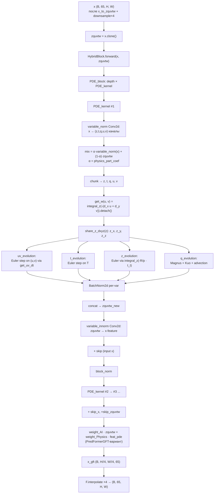

# Physics integrators — audit
_updated 2026-05-14_

Аудит численных схем, физических операторов и временных интеграторов в репозитории WeatherPredictions. Все ссылки на код — markdown-линки. Документ строится по фактическому коду на момент обновления (commit `daa3fb7`, ветка `refactoring`).

## TL;DR

- **Все физические интеграторы инкапсулированы в `Models/`** (модули `WeatherGFT*.py`, `PredFormerGFT*.py`, `PI_IAM4VP.py`). В [utils/](../utils/), [training_strategies/](../training_strategies/), [trainer.py](../trainer.py), [train.py](../train.py) численных схем нет.
- **Две независимые семьи пространственных операторов**:
  - 4-го порядка центральные конечные разности `[1, −8, 0, 8, −1]/12` — в [WeatherGFT.py](../Models/WeatherGFT.py), [WeatherGFTSingle.py](../Models/WeatherGFTSingle.py).
  - WENO-5 (Jiang–Shu) — в [PredFormerGFT.py](../Models/PredFormerGFT.py), [PredFormerGFT_HybridBlock.py](../Models/PredFormerGFT_HybridBlock.py) (продакшен) и [Models/dev/PredFormerGFTSmallWorld.py](../Models/dev/PredFormerGFTSmallWorld.py) (dev).
- **Временная схема в продакшене — только Forward Euler** (`u_new = u + scale_diff(u_t · dt, u).detach()`). RK4 существует только в dev — [Models/dev/WeatherGFT_3.py](../Models/dev/WeatherGFT_3.py).
- **`.detach()` после `scale_diff` обрывает autograd через физический шаг** — физика работает как структурированный prior, градиент через `u_t, v_t, t_t, q_t, z_t` не идёт.
- **PINN/физических лоссов нет.** [utils/losses.py](../utils/losses.py) содержит только lat-weighted RMSE/MAE; никаких residual/H1/Sobolev лоссов.
- **DRY-долг крупный**: ~150 строк FD/WENO кода и `PDE_kernel` дублируются между 4 production-файлами и 3 dev-файлами. Общего модуля `utils/physics.py` нет.
- **Сетка задаётся на уровне модуля** через константу `latents_size` (`pixel_x`, `pixel_y`, `M_z` — module-globals, вычисляются при `import`). Это вшивает разрешение в модуль; разные файлы имеют разные значения (`[8, 16]` или `[32, 64]`).
- **Граничные условия везде периодические** по lat/lon/p — нефизично у полюсов и у границ давления, но для USA-кропа 32×64 даёт сглаживание у edge (≈ ≤ 5% узлов).

## Glossary

- **FD** — Finite Differences. В этом репо — центральные 4-го порядка, шаблон `[1, −8, 0, 8, −1]/12` (axis-зависимый знак).
- **WENO-5** — Weighted Essentially Non-Oscillatory 5-го порядка. Адаптивная комбинация трёх 3-точечных шаблонов; не осциллирует на разрывах. Реализация — Jiang & Shu (1996) с оптимальными весами `d = [0.1, 0.6, 0.3]`.
- **stencil** — точки сетки, по которым считается производная. FD-4 использует 5 точек, WENO-5 использует 5 точек (`u_{i−2..i+2}`) на интерфейс ячейки.
- **CFL** — условие устойчивости явной схемы по времени, `c · dt / dx ≤ const`. В коде **нет проверки CFL**; `block_dt` задаётся в конфиге (300 c или 1200 c).
- **RK4** — Runge–Kutta 4-го порядка, 4 оценки RHS на шаг.
- **Forward Euler** — 1-й порядок по времени, одна оценка RHS на шаг.
- **geopotential (z)** — геопотенциал поверхности постоянного давления, м²/с². В коде эволюционируется напрямую через гидростатику.
- **Coriolis (f)** — параметр Кориолиса, рад/с. В [WeatherGFT.py](../Models/WeatherGFT.py) — константа `7.29e-5`, в [PredFormerGFT.py](../Models/PredFormerGFT.py) — beta-plane `f = f0 + β·y`, в dev/WeatherGFT_3 — сферический `f = 2Ω sin φ`.
- **USA-кроп** — пространственный вырез ERA5: `cut=[[36,68],[125,189]]` (для PredFormerGFT, см. [configs/predformergft.yaml:36](../configs/predformergft.yaml#L36)) или `cut=[[75,107],[164,228]]` (для PredFormer USA v4 — см. memory). Даёт `H=32, W=64` на нормальном разрешении.
- **`zquvtw`** — внутреннее обозначение для тензора `[z, q, u, v, t]` (5 переменных по 13 уровней давления = 65 каналов). Имя сохранилось, хотя `w` уже не присутствует в нём (w — диагностическая, не часть состояния).
- **`physics_part_coef`** — скалярный либо тензорный коэффициент смешивания «AI-эмбеддинга» и «physics-эмбеддинга» внутри `PDE_kernel.forward` (не путать с `router_weight` в `HybridBlock`).
- **`router_weight`** — обучаемый параметр `HybridBlock` формы `[1, 1, 1, dim]`, через него `weight_AI = 0.5 + router_weight`, `weight_Physics = 0.5 − router_weight`.

---

## Integrators

### `integral_z` — вертикальное интегрирование по давлению

**Files (идентичные копии):**
- [Models/WeatherGFT.py:40-46](../Models/WeatherGFT.py#L40-L46)
- [Models/WeatherGFTSingle.py:40-46](../Models/WeatherGFTSingle.py#L40-L46)
- [Models/PredFormerGFT.py:42-48](../Models/PredFormerGFT.py#L42-L48)
- [Models/PredFormerGFT_HybridBlock.py:43-49](../Models/PredFormerGFT_HybridBlock.py#L43-L49)
- [Models/dev/WeatherGFT_3.py:41-47](../Models/dev/WeatherGFT_3.py#L41-L47)

**Math:** Накопительный интеграл по вертикали через нижнетреугольную матрицу `M_z`.

$$
\big(I_z f\big)_{i,h,w} = \sum_{j=i}^{N_p - 1} \Delta p_j \, f_{j,h,w}
$$

В коде:
```python
M_z[i, j] = pixel_z[j]  if i <= j  else 0      # WeatherGFT.py:33-37
output = M_z @ input_flat                       # WeatherGFT.py:44
```

**Tensor contract:** in `(B, 13, H, W)` → out `(B, 13, H, W)`, dtype/device наследуются от входа (через `.to(...)`).

**Grid:** `pixel_z = [50, 50, 50, 50, 50, 75, 100, 100, 100, 125, 112, 75, 75]` гПа — неравномерное распределение между 13 уровнями давления ERA5 (50…1000 гПа). См. [Models/WeatherGFT.py:29](../Models/WeatherGFT.py#L29).

**Buffers:** `M_z` — module-global `(13, 13)`, **не зарегистрирован как buffer**, а просто `torch.zeros(...)` на CPU. На GPU переезжает через `.to(input_tensor.device)` каждый вызов.

**CFL/dt:** Не применимо (диагностический оператор).

**Autograd:** ✅ Линейная операция, autograd-совместима. Однако вызывается из `get_w` с `.detach()` ([Models/WeatherGFT.py:231](../Models/WeatherGFT.py#L231)) — реальный вертикальный ветер отрезан от графа.

**Used by:** `PDE_kernel.get_w()` (диагностика `w`) и `PDE_kernel.get_z_t()` (эволюция геопотенциала). См. [Models/WeatherGFT.py:217](../Models/WeatherGFT.py#L217), [Models/WeatherGFT.py:231](../Models/WeatherGFT.py#L231).

**Tests:** Нет в [Models/dev/](../Models/dev/) и [utils/tests/](../utils/) (последней директории не существует).

**Notes:**
- Реализация фактически кумулятивная сумма `Σ_{j≥i} Δp_j · f_j`, что эквивалентно правилу прямоугольников для интеграла от уровня `i` до верха атмосферы. Это **не трапеции** — погрешность `O(Δp)`, а не `O(Δp²)`.
- `M_z` живёт на CPU как module-global → каждый вызов триггерит `.to(device)`. На горячем пути это лишний H2D-трансфер; кандидат на `register_buffer`.

---

### `d_x` — производная по долготе (axis=3), FD-4

**Files (продакшен):**
- [Models/WeatherGFT.py:49-68](../Models/WeatherGFT.py#L49-L68)
- [Models/WeatherGFTSingle.py:49-68](../Models/WeatherGFTSingle.py#L49-L68)

**Math:** Центральная разность 4-го порядка.

$$
\frac{\partial f}{\partial x}\bigg|_i \approx \frac{f_{i-2} - 8 f_{i-1} + 8 f_{i+1} - f_{i+2}}{12 \, \Delta x_{\varphi}}
$$

где $\Delta x_{\varphi} = \dfrac{2\pi R \cos\varphi}{N_{\text{lon}}}$ — широта-зависимый шаг по долготе.

В коде (повторяется построчно во всех 4 файлах):
```python
conv_kernel[0,0,0,0] = 1                  # WeatherGFT.py:53
conv_kernel[0,0,0,1] = -8
conv_kernel[0,0,0,3] = 8
conv_kernel[0,0,0,4] = -1
input_tensor = torch.cat((input[..., -2:], input, input[..., :2]), dim=3)  # L58: periodic
output_x = F.conv2d(input_tensor, conv_kernel) / 12
output_x = output_x / pixel_x             # L66
```

**Tensor contract:** in `(B, C, H, W)` → out `(B, C, H, W)`. Внутренне reshape’ится в `(B·C, 1, H_, W_)`. Несмотря на имя «`d_x` — Latitude-direction differential» в комментарии [Models/WeatherGFT.py:50](../Models/WeatherGFT.py#L50), оператор реально дифференцирует по последней оси (W, долгота). См. ⚠ ниже.

**Grid:** `pixel_x` — buffer формы `(1, 1, H, 1)`, вычисляется при импорте модуля из `latents_size`:
```python
c_lats = 2 * π * R * cos(latitudes)       # WeatherGFT.py:22
pixel_x = c_lats / latents_size[1]
```
- В [WeatherGFT.py](../Models/WeatherGFT.py#L14): `latents_size = [8, 16]` → `pixel_x` ширины 8.
- В [WeatherGFTSingle.py](../Models/WeatherGFTSingle.py#L14): `latents_size = [32, 64]` → `pixel_x` ширины 32.
- В [PredFormerGFT.py:16](../Models/PredFormerGFT.py#L16): `[8, 16]` (комментарий рядом: `#[32, 64]`).
- В [PredFormerGFT_HybridBlock.py:17](../Models/PredFormerGFT_HybridBlock.py#L17): `[32, 64]`.

**Boundary:** периодика по W через `torch.cat((u[...,-2:], u, u[...,:2]), dim=3)` — физически корректно для глобальной долготы, **некорректно для USA-кропа** (склейка восточного побережья с западным).

**Buffers:** `pixel_x`, `pixel_y`, `pixel_z` — module-global, не зарегистрированы как `register_buffer`. На GPU переезжают через `.to(...)` в каждом вызове.

**CFL/dt:** Спатиальный оператор, dt не контролирует. Полная CFL-проверка отсутствует во всём репо.

**Autograd:** ⚠ `requires_grad=False` на `conv_kernel` ([Models/WeatherGFT.py:52](../Models/WeatherGFT.py#L52)) — коэффициенты не обучаются. Сам оператор дифференцируем по входу. Но cazquvtw-эволюция оборачивает в `.detach()`, см. `uv_evolution`.

**Notes / риски:**
- ⚠ **Naming/axis-конвенция в коде путаная**: переменные названы «x = latitude» (`pixel_x` берёт `cos(lat)`), но `d_x` дифференцирует вдоль `W` (долготы), а `d_y` — вдоль `H` (широты). Это инверсия привычного `(x=lon, y=lat)`. Проверить можно по тому, что `pixel_x` имеет shape `(1,1,H,1)` и зависит от широты — это шаг по долготе, изменяющийся с широтой. Корректно по математике, но `d_x` логически возвращает $\partial/\partial \lambda$ (по долготе).
- Стенсиль допускает в pad’е 2 значения, но в WENO-варианте используется reflect, а здесь — strict periodic. Несогласованность с WENO-веткой документирована в секции «FD vs WENO».

---

### `d_y` — производная по широте (axis=2), FD-4

**Files:** [Models/WeatherGFT.py:71-90](../Models/WeatherGFT.py#L71-L90), [WeatherGFTSingle.py:71-90](../Models/WeatherGFTSingle.py#L71-L90), [dev/WeatherGFT_3.py:72-91](../Models/dev/WeatherGFT_3.py#L72-L91).

**Math:** Центральная разность 4-го порядка с противоположным знаком (стенсиль реверсирован):

$$
\frac{\partial f}{\partial y}\bigg|_j \approx \frac{-f_{j-2} + 8 f_{j-1} - 8 f_{j+1} + f_{j+2}}{12 \, \Delta y}
$$

Знак инвертирован относительно `d_x`: `conv_kernel[0,0,0] = -1, [0,0,1] = 8, [0,0,3] = -8, [0,0,4] = 1` ([Models/WeatherGFT.py:75-78](../Models/WeatherGFT.py#L75-L78)). Это эквивалентно умножению FD-стенсиля на `−1` — производная по убывающей широте; знак ⊕/⊖ относительно `d_x` зависит от того, как ориентирован ERA5 grid (с севера на юг или с юга на север).

**Grid:** `pixel_y = π · R / (latents_size[0] + 1)` — равномерный, **не учитывает реальную сетку ERA5** (на самом деле узлы по широте равномерны в градусах, что для сферы тоже равномерно по метрам).

**Boundary:** периодика по H через `torch.cat((u[..., :2], u, u[..., -2:]), dim=2)` ([Models/WeatherGFT.py:80-82](../Models/WeatherGFT.py#L80-L82)) — это **нефизично у полюсов**: склейка северного полюса с самим собой через wrap-around. Для USA-кропа полюса отсутствуют, эффект только на 2 строчках сверху/снизу crop’а.

**Tensor contract / autograd / buffers:** аналогично `d_x`.

**Notes:**
- ⚠ Использование `torch.cat((u[..., :2], u, u[..., -2:]), dim=2)` — это **reflective-like wrap**, а не настоящий periodic (южная граница дублирует первые 2 строки сама в себя). Реальная периодика по широте в принципе физически некорректна (широта не периодична).

---

### `d_z` — вертикальная производная по давлению, FD-4

**Files:** [Models/WeatherGFT.py:93-110](../Models/WeatherGFT.py#L93-L110), [PredFormerGFT.py:151-166](../Models/PredFormerGFT.py#L151-L166), [PredFormerGFT_HybridBlock.py:152-167](../Models/PredFormerGFT_HybridBlock.py#L152-L167), [dev/WeatherGFT_3.py:94-111](../Models/dev/WeatherGFT_3.py#L94-L111).

**Math:**

$$
\frac{\partial f}{\partial p}\bigg|_k \approx \frac{-f_{k-2} + 8 f_{k-1} - 8 f_{k+1} + f_{k+2}}{12 \, \Delta p_k}
$$

с неравномерным $\Delta p_k$ по `pixel_z`. Реализация через `F.conv3d` ([Models/WeatherGFT.py:106](../Models/WeatherGFT.py#L106)).

**Boundary:** периодика по уровням давления через `torch.cat((u[:, :2], u, u[:, -2:]), dim=1)` ([Models/WeatherGFT.py:101-103](../Models/WeatherGFT.py#L101-L103)) — ⚠ **физически некорректно**: верхний (50 гПа) уровень склеивается с нижним (1000 гПа). Эффект локализован на k=0,1 и k=11,12 (4 из 13 уровней, ≈30% столба).

**Notes:**
- Неравномерное `Δp` корректно учитывается per-channel через `output_z / pixel_z` ([WeatherGFT.py:108](../Models/WeatherGFT.py#L108)). Но 4-й порядок точности теряется при неравномерной сетке (`[1,−8,0,8,−1]/12` точен только для равномерного шага). По факту схема становится **формально первого порядка**, не четвёртого, на нерегулярной части `pixel_z` (там, где шаг меняется: 50→75→100→125→112).
- 5-точечный шаблон через 13 уровней — это треть глубины атмосферы; «локальная» производная на одном уровне на самом деле смешана с 2 уровнями вверх/вниз ≈ ±150 гПа.

---

### `weno5_flux` + `weno_derivative` — WENO-5 производная

**Files:**
- [Models/PredFormerGFT.py:52-145](../Models/PredFormerGFT.py#L52-L145)
- [Models/PredFormerGFT_HybridBlock.py:53-146](../Models/PredFormerGFT_HybridBlock.py#L53-L146)
- [Models/dev/PredFormerGFTSmallWorld.py](../Models/dev/PredFormerGFTSmallWorld.py) — dev-копия.

**Math (Jiang & Shu, 1996):** для интерфейса $i+\tfrac{1}{2}$ строятся три 3-точечных кандидата:

$$
\begin{aligned}
f^{(1)} &= \tfrac{1}{6}(2 u_{i-2} - 7 u_{i-1} + 11 u_i)\\
f^{(2)} &= \tfrac{1}{6}(-u_{i-1} + 5 u_i + 2 u_{i+1})\\
f^{(3)} &= \tfrac{1}{6}(2 u_i + 5 u_{i+1} - u_{i+2})
\end{aligned}
$$

Гладкостные индикаторы:

$$
\begin{aligned}
\beta_1 &= \tfrac{13}{12}(u_{i-2}-2u_{i-1}+u_i)^2 + \tfrac{1}{4}(u_{i-2}-4u_{i-1}+3u_i)^2\\
\beta_2 &= \tfrac{13}{12}(u_{i-1}-2u_i+u_{i+1})^2 + \tfrac{1}{4}(u_{i-1}-u_{i+1})^2\\
\beta_3 &= \tfrac{13}{12}(u_i-2u_{i+1}+u_{i+2})^2 + \tfrac{1}{4}(3u_i-4u_{i+1}+u_{i+2})^2
\end{aligned}
$$

Веса:

$$
\alpha_k = \frac{d_k}{(\varepsilon + \beta_k)^2}, \quad \omega_k = \frac{\alpha_k}{\sum_j \alpha_j}, \quad d = (0.1, 0.6, 0.3), \, \varepsilon = 10^{-6}
$$

Поток на интерфейсе: $\hat f_{i+1/2} = \sum_k \omega_k f^{(k)}$. См. [PredFormerGFT.py:77-95](../Models/PredFormerGFT.py#L77-L95).

Производная через flux divergence:

$$
\frac{du}{dx}\bigg|_i \approx \frac{\hat f_{i+1/2} - \hat f_{i-1/2}}{\Delta x}
$$

([PredFormerGFT.py:106-120](../Models/PredFormerGFT.py#L106-L120)). `flux_imhalf` получают через `torch.roll(flux_iphalf, shifts=1, dims=-1)` для periodic, либо клонированием сдвига для reflect.

**Tensor contract:** in `(..., W)` → out `(..., W)` (по последней оси). Wrap’ы `d_x_weno`/`d_y_weno` принимают `(B, C, H, W)` и `permute`’ят оси.

**Grid:** `dx` принимается как параметр; в `d_x_weno` подставляется `pixel_x.expand(B, C, H, 1).reshape(B*C*H)` (т.е. широта-зависимый шаг), в `d_y_weno` — скалярный `pixel_y`. См. [PredFormerGFT.py:123-145](../Models/PredFormerGFT.py#L123-L145).

**Boundary:** default `reflect` в `d_x_weno`/`d_y_weno` (через `F.pad(mode="reflect")`). Periodic доступен флагом, но не используется по умолчанию.

**CFL/dt:** Не контролируется. Для WENO рекомендуется TVD-RK (RK3 Shu–Osher) для соответствия порядку точности по времени — **в коде нигде не реализовано**.

**Autograd:** ✅ Чистая алгебра (roll, pad, арифметика), autograd-совместима. Но в горячих местах вызывается через `compute_derivative_with_amr` ([PredFormerGFT.py:277-283](../Models/PredFormerGFT.py#L277-L283)) и через `.detach()` в `uv_evolution`.

**Used by:**
- `d_x = d_x_weno` ([PredFormerGFT.py:148](../Models/PredFormerGFT.py#L148)).
- `d_y = d_y_weno` ([PredFormerGFT.py:149](../Models/PredFormerGFT.py#L149)).
- Все методы `PDE_kernel.get_uv_dt`, `get_t_t`, `get_q_dt`, `get_w` ([PredFormerGFT.py:275-369](../Models/PredFormerGFT.py#L275-L369)).
- `laplacian_tensor` ([PredFormerGFT.py:169-171](../Models/PredFormerGFT.py#L169-L171)).

**Tests:** Нет.

**Notes / риски:**
- ⚠ **WENO считается на ячейке-центрической функции, но используется как производная скаляра**, без сохранения консервативности по физическим переменным (нет cell-area weighting). Для решения уравнений неконсервативной формы (как тут адвекция $u \cdot \partial u / \partial x$ в [WeatherGFT.py:182](../Models/WeatherGFT.py#L182)) это ОК; для консервативной формы ($\partial(u^2)/\partial x$ в [PredFormerGFT.py:277](../Models/PredFormerGFT.py#L277)) это полу-корректно — WENO применяется к произведению скаляров, а не к flux’у физической переменной.
- При `dx.dim() == 1` `dx.unsqueeze(-1)` ([PredFormerGFT.py:119](../Models/PredFormerGFT.py#L119)) — корректное broadcasting’овое приведение к форме входа.

---

### `laplacian_tensor` — 2D-Лапласиан

**Files:** [Models/PredFormerGFT.py:168-171](../Models/PredFormerGFT.py#L168-L171), [PredFormerGFT_HybridBlock.py:169-172](../Models/PredFormerGFT_HybridBlock.py#L169-L172).

**Math:** $\nabla^2 u = \partial^2 u / \partial x^2 + \partial^2 u / \partial y^2$, реализован как двойное применение WENO-производной:

```python
d2u_dx2 = d_x(d_x(u))   # PredFormerGFT.py:169
d2u_dy2 = d_y(d_y(u))
return d2u_dx2 + d2u_dy2
```

**Notes:**
- ⚠ Двойное применение WENO-5 даёт **смешанную точность**: формально 5-й порядок, но WENO-веса посчитаны для смесей трёх 3-точечных flux’ов; вторая производная как `d_x(d_x(·))` накапливает погрешность нелинейного weighting’а. В классике WENO для лапласиана используют центральный FD-2 (`u_{i-1} − 2u_i + u_{i+1}`), а не двойную WENO.
- В [WeatherGFT.py](../Models/WeatherGFT.py) лапласиана нет — функция определена только в `PredFormerGFT*`-файлах.

**Used by:** только `PDE_kernel.get_uv_dt` при `eddy_viscosity > 0` ([PredFormerGFT.py:289-293](../Models/PredFormerGFT.py#L289-L293)). По дефолту `eddy_viscosity=0.0` ([PredFormerGFT.py:208](../Models/PredFormerGFT.py#L208)), т.е. **в реальных запусках мёртвая ветка**, если конфиг не переопределяет.

---

### `adaptive_mesh_refinement` / `compute_derivative_with_amr` — псевдо-AMR

**Files:** [Models/PredFormerGFT.py:175-200](../Models/PredFormerGFT.py#L175-L200), [PredFormerGFT_HybridBlock.py:176-201](../Models/PredFormerGFT_HybridBlock.py#L176-L201).

**Math (упрощённый):**
```python
grad_field = sqrt(d_x(field)**2 + d_y(field)**2)         # L180
if grad_field.max() > grad_threshold:                    # L181, grad_threshold = 1e-3
    refined = F.interpolate(field, scale_factor=2, mode='bilinear')  # L182
    refined_deriv = derivative_fn(refined)
    return F.interpolate(refined_deriv, scale_factor=0.5, mode='bilinear')
else:
    return derivative_fn(field)
```

**Notes / риски:**
- ⚠ Это **не AMR** в численном смысле. AMR — это пере-сетка с локально различной плотностью. Здесь просто bilinear-апскейл всего поля, вычисление производной, и down-sampling. Эффективная точность — `O(Δx²)` от bilinear-интерполяции, что **ниже** базового FD-4 и WENO-5 → схема, скорее всего, **снижает** точность, а не повышает.
- Срабатывает по `grad_field.max() > 1e-3` — в нормированных полях ERA5 (порядка ±1) этот порог почти всегда превышен, т.е. AMR срабатывает почти всегда.
- ⚠ `align_corners=True` в `F.interpolate` ([PredFormerGFT.py:182](../Models/PredFormerGFT.py#L182), L196) — устаревший флаг, может приводить к небольшим артефактам у границ.
- Стоимость: O(4×) операций (2×2 пикселей на каждый исходный).

**Used by:** `PDE_kernel.get_uv_dt` для нелинейных адвективных членов `u·u, u·v, v·v` ([PredFormerGFT.py:277-283](../Models/PredFormerGFT.py#L277-L283)).

---

### `PDE_kernel` — первичная физическая ячейка

**Files:**
- [Models/WeatherGFT.py:113-307](../Models/WeatherGFT.py#L113-L307) (FD, Euler, константный `f`, lat-крайний crop).
- [Models/WeatherGFTSingle.py:113-307](../Models/WeatherGFTSingle.py#L113-L307) — копия с `latents_size=[32,64]`.
- [Models/PredFormerGFT.py:207-407](../Models/PredFormerGFT.py#L207-L407) (WENO, Euler, beta-plane Coriolis, eddy viscosity, AMR).
- [Models/PredFormerGFT_HybridBlock.py:208-408](../Models/PredFormerGFT_HybridBlock.py#L208-L408) — копия с `latents_size=[32,64]`.
- [Models/dev/WeatherGFT_3.py:114-541](../Models/dev/WeatherGFT_3.py#L114-L541) (FD, RK4, сферический Coriolis, turbulent mixing, radiative cooling, convective precip).

**Uniform shape contract (all variants):** `forward(x, zquvtw)` принимает `x: (B, D, H, W)`, `zquvtw: (B, 5·13, H, W)`. Возвращает обновлённые `(x', zquvtw')` тех же форм. Внутри `zquvtw` разрезается на `[z, t, q, u, v]` по 13 каналам каждый ([WeatherGFT.py:285](../Models/WeatherGFT.py#L285)).

**Physical constants** (одинаковые во всех вариантах, [WeatherGFT.py:125-131](../Models/WeatherGFT.py#L125-L131)):
- `f = 7.29e-5` рад/с — Coriolis (только в FD-варианте; см. также бета-plane и сферический в других).
- `L = 2.5e6` Дж/кг — скрытая теплота парообразования.
- `R = 8.314` Дж/(моль·К) — универсальная газовая постоянная.
- `c_p = 1005` Дж/(кг·К) — теплоёмкость воздуха при постоянном давлении.
- `R_v = 461.5` Дж/(кг·К), `R_d = 287` Дж/(кг·К) — газовые постоянные водяного пара и сухого воздуха.
- `diff_ratio = 0.05` — масштаб scale_diff’а.

**Equations (восстановлены из кода):**

1. **Континуити → диагностика w** ([WeatherGFT.py:227-232](../Models/WeatherGFT.py#L227-L232)):
$$
\frac{\partial w}{\partial p} = -\left(\frac{\partial u}{\partial x} + \frac{\partial v}{\partial y}\right), \quad w = \int_{0}^{p} \big(-(u_x + v_y)\big) dp'
$$
   `w = integral_z(w_z).detach()` — детачится.

2. **Гидростатика → производная z по p** ([WeatherGFT.py:211-218](../Models/WeatherGFT.py#L211-L218)):
$$
\frac{\partial}{\partial t}\!\left(\frac{\partial z}{\partial p}\right) = -\frac{R}{p}\frac{\partial T}{\partial t}, \quad \frac{\partial z}{\partial t} = \int_{0}^{p}\!\left(-\frac{R}{p}\frac{\partial T}{\partial t}\right)\,dp'
$$
   В коде `z_zt = -R / pressure * t_t; z_t = integral_z(z_zt)`. Заметим, что в формуле должно быть $R_d$ (для сухого воздуха, ≈287 Дж/(кг·К)), а в коде используется **универсальная** `R = 8.314` Дж/(моль·К) — ⚠ это **физически некорректно** (либо нужно делить на молярную массу воздуха 0.029, чтобы получить $R_d$, либо использовать `self.R_d` напрямую). Это, возможно, скомпенсировано `scale_diff`-clipping’ом, но не математически.

3. **Уравнение импульса (FD-вариант, [WeatherGFT.py:182-183](../Models/WeatherGFT.py#L182-L183))**:
$$
\begin{aligned}
\frac{\partial u}{\partial t} &= -u \frac{\partial u}{\partial x} - v \frac{\partial u}{\partial y} - w \frac{\partial u}{\partial p} + f v - \frac{\partial z}{\partial x}\\
\frac{\partial v}{\partial t} &= -u \frac{\partial v}{\partial x} - v \frac{\partial v}{\partial y} - w \frac{\partial v}{\partial p} - f u - \frac{\partial z}{\partial y}
\end{aligned}
$$
   В WENO-варианте те же уравнения, но адвекция записана в полу-консервативной форме `∂(u²)/∂x + ∂(uv)/∂y + ∂(uw)/∂p` ([PredFormerGFT.py:277-283](../Models/PredFormerGFT.py#L277-L283)).

4. **Температура (FD-вариант, [WeatherGFT.py:200-202](../Models/WeatherGFT.py#L200-L202))**:
$$
\frac{\partial T}{\partial t} = \frac{Q - z_p w}{c_p} - u \frac{\partial T}{\partial x} - v \frac{\partial T}{\partial y} - w \frac{\partial T}{\partial p}, \quad Q = -L \, z_p \, w
$$
   Подставляя $Q$: $\frac{\partial T}{\partial t} = \frac{-L z_p w - z_p w}{c_p} - \mathbf{u}\!\cdot\!\nabla T = -\frac{(L+1) z_p w}{c_p} - \mathbf{u}\!\cdot\!\nabla T$. ⚠ **Подозрительно**: $L=2.5\cdot 10^6$ доминирует над «1»; почему именно `(Q - z_z·w)/c_p` а не `Q/c_p`? Если `Q` уже всё латентное тепло, то вычитание ещё одного `z_p w` — лишнее. Возможный баг или специфичная schematic-форма; нужно поднять в open questions.

5. **Влажность (FD, [WeatherGFT.py:237-272](../Models/WeatherGFT.py#L237-L272))**: Magnus-формула для $q_s$, плюс fraction-of-saturation switch `δ` и фактор $F$ — соответствует упрощённой Kuo-схеме конденсации.

**Time integration (Forward Euler, [WeatherGFT.py:187-191](../Models/WeatherGFT.py#L187-L191))**:
```python
u_t, v_t = self.get_uv_dt(u, v, w)
u = u + self.scale_diff(u_t * self.block_dt, u).detach()
v = v + self.scale_diff(v_t * self.block_dt, v).detach()
```
- `block_dt = 300` сек по умолчанию ([WeatherGFT.py:114](../Models/WeatherGFT.py#L114)), в PI-IAM4VP — `block_dt = 1200` ([PI_IAM4VP.py:144](../Models/PI_IAM4VP.py#L144)).
- `scale_diff` ([WeatherGFT.py:154-159](../Models/WeatherGFT.py#L154-L159)): диапазон tendencies зажимается в `[(x_min−x_mean)·0.05, (x_max−x_mean)·0.05]`. Это **ad-hoc damping**, не из физики.
- `.detach()` обрывает autograd-граф по `u_t, v_t, t_t, q_t, z_t`. См. секцию «Autograd» ниже.

**Autograd: ⚠ partial.**
- Через `variable_norm` (Conv2d), `variable_innorm` (Conv2d), `block_norm`, `physics_part_coef` — да.
- Через `u_t, v_t, t_t, q_t, z_t · block_dt` → нет, отрезано `.detach()` в `*_evolution`.
- Через `q_s, δ, F_` (вспомогательные диагностики влажности) — нет, отрезаны `.detach()` ([WeatherGFT.py:261-264](../Models/WeatherGFT.py#L261-L264)).
- Через `w` (диагностика континуити) — нет, отрезано ([WeatherGFT.py:231](../Models/WeatherGFT.py#L231)).

**Used by:** `PDE_block` (стек из `depth` копий, [WeatherGFT.py:311-326](../Models/WeatherGFT.py#L311-L326)).

**Notes / риски:**
- ⚠ `R = 8.314` Дж/(моль·К) в гидростатике — некорректная подстановка газовой постоянной (должно быть `R_d = 287` Дж/(кг·К)).
- ⚠ `scale_tensor(... , -3.47, 3.01)` в Magnus-формуле ([WeatherGFT.py:240](../Models/WeatherGFT.py#L240)) — клиппинг аргумента экспоненты. `exp(-3.47) ≈ 0.031`, `exp(3.01) ≈ 20.3`, т.е. $e_s \in [0.19, 124]$ Па. ⚠ Это **жёсткий клиппинг для температуры**, не физическое выражение. Реальный $e_s$ для $T \in [200, 320]$ K варьируется на 6 порядков; clipping убивает зависимость от температуры в холодных регионах.
- `BatchNorm2d` применяется к **физически-эволюционированным** полям ([WeatherGFT.py:295-299](../Models/WeatherGFT.py#L295-L299)) — стирает физические единицы измерения, делает «физику» по сути выученной репрезентацией.

---

### `PDE_block` — стек `PDE_kernel`'ей

**Files (идентичные копии):**
- [Models/WeatherGFT.py:311-326](../Models/WeatherGFT.py#L311-L326)
- [Models/WeatherGFTSingle.py:311-326](../Models/WeatherGFTSingle.py#L311-L326)
- [Models/PredFormerGFT.py:411-425](../Models/PredFormerGFT.py#L411-L425)
- [Models/PredFormerGFT_HybridBlock.py:410-425](../Models/PredFormerGFT_HybridBlock.py#L410-L425)
- [Models/dev/WeatherGFT_3.py:545-559](../Models/dev/WeatherGFT_3.py#L545-L559)

Стекает `depth` копий `PDE_kernel` (по дефолту 3) и применяет последовательно. Полное время эволюции на блок: `depth · block_dt = 3 · 300 = 900` сек = 15 минут (в PI-IAM4VP: `3 · 1200 = 3600` сек = 1 час).

Skip-connection `x + skip_x, zquvtw + skip_zquvtw` ([WeatherGFT.py:325](../Models/WeatherGFT.py#L325)) — residual.

**Tensor contract:** in `(B, H, W, D)` → permute → `(B, D, H, W)` → kernel → permute → `(B, H, W, D)`. Внутри kernel’а оси `(B, D, H, W)`, на границе — `(B, H, W, D)`.

---

### `HybridBlock` — AI ⊕ Physics routing

**Files:**
- [Models/WeatherGFT.py:466-499](../Models/WeatherGFT.py#L466-L499) — с WindowAttention.
- [Models/PredFormerGFT.py:764-779](../Models/PredFormerGFT.py#L764-L779) — без attention, чистый router.
- [Models/PredFormerGFT_HybridBlock.py:776-791](../Models/PredFormerGFT_HybridBlock.py#L776-L791).

**WeatherGFT-вариант ([WeatherGFT.py:482-499](../Models/WeatherGFT.py#L482-L499)):**
```python
feat_att = self.attention_block(x)
feat_pde, zquvtw = self.pde_block(x, zquvtw)
weight_AI = 0.5*ones + self.router_weight
weight_Physics = 0.5*ones - self.router_weight
x = weight_AI*feat_att + weight_Physics*feat_pde
```

**PredFormerGFT-вариант ([PredFormerGFT.py:771-779](../Models/PredFormerGFT.py#L771-L779)):**
```python
feat_pde, zquvtw = self.pde_block(x, zquvtw)
weight_AI = 0.5*ones + self.router_weight
weight_Physics = 0.5*ones - self.router_weight
x = weight_AI*zquvtw + weight_Physics*feat_pde   # ⚠ AI-вес умножается на zquvtw, не на attn-результат
```

⚠ **Несимметричность**: в WeatherGFT AI-ветка — это `feat_att` (выход attention); в PredFormerGFT AI-ветка — это сам `zquvtw` (вход в pde_block). Это разные семантики «AI» для одинакового имени `HybridBlock`. Стоит вынести в open questions.

`router_weight` ([WeatherGFT.py:478](../Models/WeatherGFT.py#L478)): `nn.Parameter(torch.zeros(1, 1, 1, dim), requires_grad=True)`. Инициализирован нулём → стартовый mix 0.5/0.5.

**Used by:**
- `GFT.body` в [WeatherGFT.py:683-696](../Models/WeatherGFT.py#L683-L696) — стопка из 6×4=24 HybridBlock’ов.
- `PredFormer_Model._init_gft_block` в [PredFormerGFT.py:660-672](../Models/PredFormerGFT.py#L660-L672) — один HybridBlock per model.
- `IAM4VP.__init__` в [PI_IAM4VP.py:144](../Models/PI_IAM4VP.py#L144) — один HybridBlock, `depth=3, block_dt=1200`.

---

### dev-only: RK4 в `PDE_kernel`

**File:** [Models/dev/WeatherGFT_3.py:255-285](../Models/dev/WeatherGFT_3.py#L255-L285) (`uv_evolution`), L323-357 (`t_evolution`), L370-410 (`z_evolution`), L463-496 (`q_evolution`).

**Math (классический RK4):**
$$
\begin{aligned}
k_1 &= F(u^n, v^n, w^n)\\
k_2 &= F(u^n + \tfrac{\Delta t}{2} k_1, \dots)\\
k_3 &= F(u^n + \tfrac{\Delta t}{2} k_2, \dots)\\
k_4 &= F(u^n + \Delta t \, k_3, \dots)\\
u^{n+1} &= u^n + \tfrac{\Delta t}{6} (k_1 + 2 k_2 + 2 k_3 + k_4)
\end{aligned}
$$

В коде ([dev/WeatherGFT_3.py:260-285](../Models/dev/WeatherGFT_3.py#L260-L285)) реализовано **с применением `scale_diff` к финальному tendency**:
```python
u_tendency = (k1_u + 2*k2_u + 2*k3_u + k4_u) / 6.0
u_new = u_orig + self.scale_diff(u_tendency * self.block_dt, u_orig).detach()
```

⚠ **Это формально не RK4**: после `scale_diff` нет гарантии, что итерация совпадает с теоретической RK4. Это RK4-для-tendency-оценки + ad-hoc клиппинг.

**Stage-issue в `q_evolution`** ([dev/WeatherGFT_3.py:467-496](../Models/dev/WeatherGFT_3.py#L467-L496)): на стейджах k2..k4 переиспользуется `z_t` со стейджа 1 (комментарий L472-473 признаёт это). Корректный RK4 требует пересчёта всех связанных `*_t` на каждом этапе.

**Status:** dev-only, **не вызывается из production-моделей**. Регистр `Models/__init__.py` импортирует только `WeatherGFT` (не `_3`).

---

## FD vs WENO

| Aspect | FD-4 (WeatherGFT) | WENO-5 (PredFormerGFT) |
|---|---|---|
| Files | [Models/WeatherGFT.py](../Models/WeatherGFT.py), [WeatherGFTSingle.py](../Models/WeatherGFTSingle.py), dev | [PredFormerGFT.py](../Models/PredFormerGFT.py), [PredFormerGFT_HybridBlock.py](../Models/PredFormerGFT_HybridBlock.py) |
| Формальный порядок | 4-й (на равномерной сетке) | 5-й (в гладких регионах) |
| Stencil width | 5 точек | 5 точек (3 кандидата по 3) |
| Адаптивность | нет | ω-веса по гладкости |
| Дисперсия / диссипация | малая дисперсия, низкая численная диссипация | upwind-биас → умеренная диссипация, ловит шоки |
| Граница (lon, axis W) | periodic через `torch.cat` | reflect (default) или periodic |
| Граница (lat, axis H) | periodic через `torch.cat` (нефизично у полюсов) | reflect (default) |
| Cos(lat) в `pixel_x` | ✅ | ✅ |
| Стоимость на узел | 1× conv2d 1×5 | ~5× базовых операций + nonlinear ω |
| Применяется к | u, v, T, q, z | u, v, T, q, z |
| Адвекция | неконсервативная (`u·∂u/∂x`) | полу-консервативная (`∂(u²)/∂x`) с AMR-pseudo |
| Eddy-viscosity Laplacian | нет | есть, default off (η=0) |
| Coriolis | constant `f=7.29e-5` | beta-plane `f0 + β·y` |
| Конечная RK-связка | Forward Euler | Forward Euler (⚠ для 5-го порядка по пространству нужен RK3-TVD) |
| dt по умолчанию | 300 с | 300 с (1200 в PI-IAM4VP) |
| CFL-check | нет | нет |
| Точность на нелинейном решении | средняя, gibbs у фронтов | высокая, без gibbs |
| Память (per call) | ~1× input | ~3× input (3 кандидата + flux storage) |
| FLOPs (per call) | ~10 операций/узел | ~80 операций/узел |

---

## Data flow through physics

Полный путь данных через `PDE_block` в одном forward’е PredFormerGFT (одна итерация по T в [PredFormerGFT.py:730-756](../Models/PredFormerGFT.py#L730-L756)):



Key flow facts:
- **Downsampling ×4 на входе физики** ([PredFormerGFT.py:688-692](../Models/PredFormerGFT.py#L688-L692)): физика работает на 8×16 latent-grid, не 32×64 USA-кропе.
- **Расщепление каналов 4 + 65** ([PredFormerGFT.py:733](../Models/PredFormerGFT.py#L733)): первые 4 канала (T2m, u10, v10, tp — sfc-вариативы) НЕ идут в физику; идут только pressure-level переменные.
- **Внешний loop по T** ([PredFormerGFT.py:730-756](../Models/PredFormerGFT.py#L730-L756)): для каждого предсказанного timestep’а физика запускается заново на предыдущем предсказании. autoregressive-rollout физики, **без** связи с tendencies между timesteps.

---

## Shared infrastructure

**Coordinate buffers (module-global, не `register_buffer`):**
- `latitudes` — широты в радианах, форма `(H,)`. См. [WeatherGFT.py:19-20](../Models/WeatherGFT.py#L19-L20).
- `c_lats` — `2πR cos φ`, `(1, 1, H, 1)`.
- `pixel_x` — `c_lats / N_lon`, `(1, 1, H, 1)`, метры.
- `pixel_y` — `πR / (N_lat+1)`, скаляр, метры.
- `pressure` — `[50, 100, ..., 1000]` гПа, `(1, 13, 1, 1)`.
- `pixel_z` — `Δp` неравномерный, `(1, 13, 1, 1)`.
- `M_z` — нижне-треугольная `(13, 13)` для `integral_z`.

⚠ Все они вычисляются **при импорте модуля**. Это:
1. Делает зависимость от GPU неявной (`.to(device)` в каждом вызове).
2. Фиксирует `latents_size` глобально на модуль — нельзя иметь два разных разрешения в одной программе из одного файла.
3. Не передаётся через `state_dict()`, не валидируется при загрузке чекпоинта (если код поменял `latents_size` после обучения — silent breakage).

**Beta-plane Coriolis (только PredFormerGFT*):**
- `f_field` зарегистрирован как **настоящий** `register_buffer` ([PredFormerGFT.py:225-226](../Models/PredFormerGFT.py#L225-L226)) — единственный физический оператор с честным buffer’ом в этом репо.
- Формула: $f = f_0 + \beta y$, $y = R \varphi$, $f_0 = 7.29\cdot10^{-5}$, $\beta = 1.6\cdot10^{-11}$ рад/(с·м).
- ⚠ Это **beta-plane**, корректна только для узкой полосы широт (±30°). USA-кроп лежит около 23–47° N, на границе применимости.

**Static masks (только PredFormerGFT*):**
- [PredFormerGFT.py:621-629](../Models/PredFormerGFT.py#L621-L629): загружаются orography, soil-type, land-sea-mask из netCDF `constants.nc`, обрезаются по hard-coded crop `[128-92:128-60, 256-131:256-67]` (= `[36:68, 125:189]` — совпадает с конфигом).
- Используются как embedding (`mask_embedding`) в attention-пути PredFormer, **НЕ В physics-пути**.

**Variable normalization (только в `PDE_kernel`):**
- Conv2d `variable_norm` (in_dim → 65) и `variable_innorm` (65 → in_dim) — обучаемые преобразования между «model space» и «physical-state space».
- BatchNorm2d по каждой из 5 переменных в конце эволюции — стирает физические единицы.

---

## Inconsistencies & DRY candidates

### DRY-долг (необходимо вынести в `utils/physics.py` или аналог)

| Что | Количество копий | Файлы |
|---|---|---|
| `integral_z` (8 строк) | 5 | WeatherGFT.py:40, WeatherGFTSingle.py:40, PredFormerGFT.py:42, PredFormerGFT_HybridBlock.py:43, dev/WeatherGFT_3.py:41 |
| `d_x` FD-4 (20 строк) | 5 | те же |
| `d_y` FD-4 (20 строк) | 5 | те же |
| `d_z` FD-4 (18 строк) | 5 | те же |
| `weno5_flux` (45 строк) | 3 | PredFormerGFT.py:52, PredFormerGFT_HybridBlock.py:53, dev/PredFormerGFTSmallWorld.py:52 |
| `weno_derivative` + `d_x_weno` + `d_y_weno` (50 строк) | 3 | те же |
| `laplacian_tensor` | 3 | PredFormerGFT.py:168, PredFormerGFT_HybridBlock.py:169, dev/PredFormerGFTSmallWorld.py |
| `adaptive_mesh_refinement` + `compute_derivative_with_amr` | 3 | те же |
| `PDE_kernel` (~100 строк) | 5 | все production + dev/WeatherGFT_3.py |
| `PDE_block` (15 строк) | 5 | те же |
| `HybridBlock` | 3 | WeatherGFT.py, PredFormerGFT.py, PredFormerGFT_HybridBlock.py |
| Module-level grid constants (35 строк) | 5 | все |

**Итого:** ≈ **400 LOC дубликатов** между production-файлами.

### Несоответствия

1. **`latents_size`** — module-global, разные значения в разных файлах:
   - [WeatherGFT.py:14](../Models/WeatherGFT.py#L14): `[8, 16]`.
   - [WeatherGFTSingle.py:14](../Models/WeatherGFTSingle.py#L14): `[32, 64]`.
   - [PredFormerGFT.py:16](../Models/PredFormerGFT.py#L16): `[8, 16]`.
   - [PredFormerGFT_HybridBlock.py:17](../Models/PredFormerGFT_HybridBlock.py#L17): `[32, 64]`.
   - [dev/WeatherGFT_3.py:15](../Models/dev/WeatherGFT_3.py#L15): `[32, 64]`.

   Из-за этого `pixel_x`/`pixel_y` имеют разные формы между файлами; нельзя дёрнуть `from PredFormerGFT import d_x` и применить к WeatherGFT-сценарию.

2. **Граничные условия `d_x` / `d_y` (FD) vs WENO**:
   - FD-4: `periodic` (`torch.cat`).
   - WENO: `reflect` (`F.pad`).
   - Если кто-то в будущем смешает их в одной модели — у edge’ев crop’а будет несогласованность.

3. **`get_uv_dt` форма адвекции**:
   - В FD ([WeatherGFT.py:182](../Models/WeatherGFT.py#L182)): неконсервативная `u·∂u/∂x + v·∂u/∂y + w·∂u/∂p`.
   - В WENO ([PredFormerGFT.py:277-279](../Models/PredFormerGFT.py#L277-L279)): консервативная `∂(u²)/∂x + ∂(uv)/∂y + ∂(uw)/∂p`.

   Для несжимаемой жидкости (∇·v=0) формы математически эквивалентны, но численно различаются и сравнивать tendency-ы между моделями некорректно.

4. **`HybridBlock` AI-ветка**:
   - WeatherGFT ([WeatherGFT.py:492](../Models/WeatherGFT.py#L492)): `weight_AI · feat_att` (attention output).
   - PredFormerGFT ([PredFormerGFT.py:778](../Models/PredFormerGFT.py#L778)): `weight_AI · zquvtw` (downsampled raw input).

   Не одно и то же; одинаковое имя класса вводит в заблуждение.

5. **Coriolis-параметр**:
   - WeatherGFT.py: `f = 7.29e-5` (приближенно равно `2Ω`, должно быть `2Ω sin φ ≈ 1.03e-4` на 45°).
   - PredFormerGFT.py: `f_field = f0 + β·y`, `f0 = 7.29e-5` — то же приближение.
   - dev/WeatherGFT_3.py: `f = 2·Ω·sin φ` — корректно сферически.

   ⚠ В FD-варианте константа `7.29e-5` — это `Ω`, а не `f`. Должно быть `2Ω sin φ ≈ 1.03e-4` на 45° N. Может быть опечатка (потеря фактора 2), либо умышленный half-scale.

6. **Газовая постоянная в гидростатике**: `self.R = 8.314` (универсальная, моль) используется в `get_z_zt` и `get_q_dt` вместо `self.R_d = 287` (кг). См. [WeatherGFT.py:212](../Models/WeatherGFT.py#L212), [PredFormerGFT.py:320](../Models/PredFormerGFT.py#L320).

7. **`detach()` ломает обучаемость физики**: tendency’и в `*_evolution` все отрезаны от графа. Это значит, что физический prior работает как фиксированный prior (как BatchNorm — параметры есть, но gradient flow ограничен). Это ОК как design choice, но **в код не задокументировано**.

---

## Open questions

1. **`Q = -L · z_p · w` или `Q/c_p − z_p·w/c_p`?** ([WeatherGFT.py:200-201](../Models/WeatherGFT.py#L200-L201)) — формулировка с двойным вхождением `z_p · w` подозрительна. Это конденсационное нагревание (`L·dq/dt`) или адиабатическое сжатие (`z_p·w·∂T/∂t = ω·∂T/∂t`)? Если оба — почему оба умножены на одно и то же `z_p w`?

2. **Множитель `2` в `f = 2Ω sin φ`** — отсутствует в FD-варианте (`f = 7.29e-5` ≈ `Ω`, не `2Ω`). Это **намеренно** или копи-пейст-баг? Если намеренно — обновить docstring.

3. **`R = 8.314` vs `R_d = 287`** — какая константа физически правильна для уравнения гидростатики `∂z/∂t = -R T_t / p`?

4. **`scale_diff` ad-hoc clipping** — какой физический смысл `diff_ratio = 0.05`? Это эмпирический damping или есть theoretical-основа?

5. **WENO-5 + Forward Euler** — для согласования порядков нужен RK3-TVD (Shu–Osher). Стоит ли мигрировать на RK3 в production-PredFormerGFT? Какова стоимость в FLOPs/память (×3 RHS-оценок)?

6. **Дублирование физического кода между файлами** — выделять в `utils/physics.py` сейчас или ждать стабилизации модели?

7. **AMR-pseudo bilinear-upscale → degrade точности**. Удалить ли его?

8. **`latents_size` module-global** — стоит ли параметризовать через config (с runtime-сборкой buffer’ов) или оставить как сейчас?

9. **Является ли отключенный `eddy_viscosity=0` мёртвой веткой**? Если по умолчанию выключен и нигде не включается через config — следует ли убирать или включать?

10. **`integral_z` использует `pixel_z` сверху вниз** — корректна ли семантика «integrate from top to current level» с тем, что `pixel_z[0] = 50` соответствует `p=50hPa` (верх атмосферы)?

11. **Регистрация координатных buffer’ов** — почему `f_field` через `register_buffer`, а `pixel_x`/`pixel_y`/`pixel_z`/`M_z`/`pressure` — module-global? Есть ли причина или это исторически?

---

## References

В исходниках явных академических ссылок нет — только русско-/англоязычные docstrings без цитат. Подразумеваемые источники по реализации:

- **WENO-5**: реализация совпадает с **Jiang & Shu (1996)**, *Journal of Computational Physics* 126, 202-228. Оптимальные веса `d = (0.1, 0.6, 0.3)`, гладкостные индикаторы `β_k`, ε-стабилизация — стандартный Jiang–Shu.
- **FD-4 стенсиль `[1, −8, 0, 8, −1]/12`** — стандартный центральный stencil 4-го порядка, любой учебник по CFD (Lele 1992 *Compact finite difference schemes*).
- **Magnus-формула для `e_s`**: $e_s = 6.112 \exp(17.67 \cdot T_c / (T_c + 243.5))$ — стандартная **Magnus (Tetens)**-формула, см. WMO CIMO Guide.
- **Kuo-схема конденсации** в `get_q_dt` (`δ`, `F`) — упрощённая версия **Kuo (1965, 1974)** convective parameterization.
- **Stefan-Boltzmann radiative cooling** в dev/WeatherGFT_3 — школьная формула $Q_{LW} = \epsilon \sigma T^4$, см. radiative transfer теория.
- **Beta-plane approximation**: `f = f0 + β·y` — классическая средне-широтная аппроксимация, см. Vallis (2017) *Atmospheric and Oceanic Fluid Dynamics*.
- **WeatherGFT-архитектура** — `HybridBlock` с router’ом — оригинальная идея репозитория; внешних ссылок в комментариях нет.

Если эти ссылки нужно добавить как комментарии в код — это отдельный TODO, не часть этого аудита.
